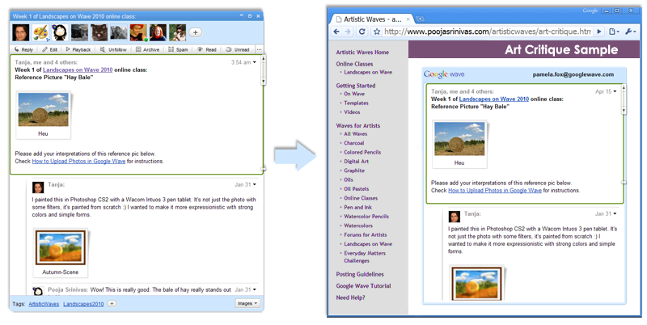

.. Licensed to the Apache Software Foundation (ASF) under one
   or more contributor license agreements.  See the NOTICE file
   distributed with this work for additional information
   regarding copyright ownership.  The ASF licenses this file
   to you under the Apache License, Version 2.0 (the
   "License"); you may not use this file except in compliance
   with the License.  You may obtain a copy of the License at

..   http://www.apache.org/licenses/LICENSE-2.0

.. Unless required by applicable law or agreed to in writing,
   software distributed under the License is distributed on an
   "AS IS" BASIS, WITHOUT WARRANTIES OR CONDITIONS OF ANY
   KIND, either express or implied.  See the License for the
   specific language governing permissions and limitations
   under the License.

Google Wave Embed API
=====================

The Google Wave Embed API is a simple JavaScript API that lets you embed a wave
on your own website, anywhere on the web. Once embedded, you can interact with
the wave on your site in the same way that you would use it in the client. Any
embedded waves also show up in the Google Wave client for involved participants,
so they can follow and interact with the waves there too.

For example, you can use the embed API to embed "live waves" of events in a
blog, to embed wiki-like waves in your CMS or Google site, or to embed
robot-created waves in your application.

If you are simply looking to embed a single wave in a webpage, you can copy the
code from the "Link to this Wave" button on the wave, or use the Wave Web
Element for further configuration. You can also read specific how-tos on
embedding waves in Blogger, and in Google Sites.

For more advanced use of the API, read through the Embed API Tutorial and
consult the short API Reference.

.. toctree::

   tutorial
   reference