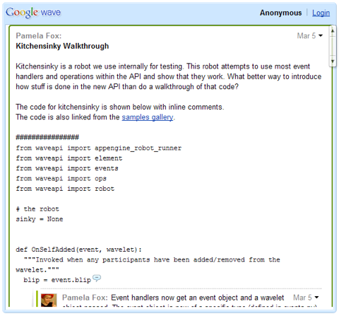

.. Licensed to the Apache Software Foundation (ASF) under one
   or more contributor license agreements.  See the NOTICE file
   distributed with this work for additional information
   regarding copyright ownership.  The ASF licenses this file
   to you under the Apache License, Version 2.0 (the
   "License"); you may not use this file except in compliance
   with the License.  You may obtain a copy of the License at

..   http://www.apache.org/licenses/LICENSE-2.0

.. Unless required by applicable law or agreed to in writing,
   software distributed under the License is distributed on an
   "AS IS" BASIS, WITHOUT WARRANTIES OR CONDITIONS OF ANY
   KIND, either express or implied.  See the License for the
   specific language governing permissions and limitations
   under the License.

Tutorial
========

Introduction
------------

This tutorial steps through embedding a wave in a webpage.
For more detailed information about the Embed API, consult the Embed API
Reference.

The "Hello, World" of Google Wave
---------------------------------
The easiest way to understand the Google Wave API is to see a simple example:

.. code-block:: html

    <!DOCTYPE html PUBLIC "-//W3C//DTD XHTML 1.0 Strict//EN"
        "http://www.w3.org/TR/xhtml1/DTD/xhtml1-strict.dtd">
    <html xmlns="http://www.w3.org/1999/xhtml">
      <head>
        <meta http-equiv="content-type" content="text/html; charset=utf-8"/>
        <meta http-equiv="X-UA-Compatible" content="chrome=1">
        <title>Google Wave Embed API Example: Simple Wave</title>
        
        
      </head>
      <body >
        

      </body>
    </html>

You can download this sample and replace the ID with your own Wave ID for the
wave you wish to embed. For information on retrieving the Wave ID, see this FAQ.

Even in this simple example, there are a few things to note:

1. We include the AJAX Common Loader using a script tag and then load the Wave
   Embed API using a google.load() function.
2. We create a 
 element named "waveframe" to hold the wave. The wave will
   actually exist as an <iframe> within that element.
3. We specify the options which the wave should exhibit, including the 

   within which to place the wave.
4. We write a JavaScript function to create a WavePanel object using those
   options.
5. We initialize the wave by calling loadWave() passing a unique wave ID.
6. We specify that our function should be called when the body is loaded, using
   google.setOnLoadCallback.

These steps are explained below.

Loading the Google Wave Embed API
^^^^^^^^^^^^^^^^^^^^^^^^^^^^^^^^^

.. code-block:: html

    
    <script type="text/javascript">

    google.load("wave", "1");

The Google Wave Embed API is fully integrated with the Google AJAX APIs. This
framework allows you to use the same bootstrap and interface for loading all
supported Google AJAX APIs (including Google Wave Embed) and also provides a
common namespace for each API, allowing different Google APIs to operate
together.

Using the Google AJAX API framework is relatively simple, and involves the
following steps:

* Load the common loader from http://www.google.com/jsapi.
* Load the specific API you want using the google.load() method. The
  google.load() method takes an argument for the specific API and version
  number to load. For the embed API, specify "1" as the version.
* Use the google.wave.* namespace for all classes, methods and properties you
  use in the Google Wave Embed API.
* Create the wave in the callback function for google.setOnLoadCallback(), to
  make sure the DOM exists before trying to operate on it.

Full documentation for using the Google AJAX API loader is available at
http://code.google.com/apis/ajax/documentation/.

Wave DOM Elements
^^^^^^^^^^^^^^^^^

.. code-block:: html

    

For the wave to display on a web page, we must reserve a spot for it. Commonly,
we do this by creating a named 
 element and obtaining a reference to this
element in the browser's document object model (DOM). In the example above,
we define a 
 named "waveframe" and set its size using style attributes.
Generally, you should allow enough horizontal space for proper use of the wave
by wave participants.

Specifying Wave Options
^^^^^^^^^^^^^^^^^^^^^^^

.. code-block:: javascript

    var waveFrame = document.getElementById("waveframe");
    var embedOptions = {
      target: waveFrame
    }

Before you create your wave object (a WavePanel), you can specify what options
it should exhibit. Many of these options affect the visual behavior of the wave.
You specify these options within a Javascript object literal consisting of
key/value pairs corresponding to the properties and desired values.

One of those options specifies which HTML node should contain the embedded wave.
We specify a DOM node in the page (usually a div element) as a container for
the wave. HTML nodes are children of the JavaScript document object, and we
obtain a reference to this element via the `document.getElementById()` method.

We then create an object literal to hold the option.

The WavePanel Object
^^^^^^^^^^^^^^^^^^^^

.. code-block:: javascript

    var wavePanel = new google.wave.WavePanel(embedOptions);

The JavaScript class that holds a wave is the WavePanel class. Objects of this
class may hold a single wave on a page at a time. You may create more than one
instance of this class - each object will define a separate wave on the page.
See the reference for more information.

Loading the Wave
^^^^^^^^^^^^^^^^
.. code-block:: javascript

    wavePanel.loadWave("googlewave.com!w+Ism0RMW_A");

Once we've created a wave via the WavePanel() constructor, we need to load it
with an initial wave. This loading is accomplished via the loadWave() method,
which accepts the unique wave ID of the desired wave.

.. note::

    We don't provide a way to create a new wave from scratch in the Embed API,
    but you can use the robot or data APIs to create a wave, store the ID in a
    datastore, and then embed it in your application.

Currently, you can obtain the wave ID as indicated in this FAQ. If you create
the wave using a robot, then you can obtain the wave ID from the Wavelet class.

Initializing the Wave
^^^^^^^^^^^^^^^^^^^^^

.. code-block:: javascript

    google.setOnLoadCallback(initialize);

While an HTML page renders, the document object model (DOM) is built out, and
any external images and scripts are received and incorporated into the document
object. To ensure that our wave is only placed on the page after the page has
fully loaded, we only execute the initalize() function which constructs the
WavePanel object once the <body> element of the HTML page receives an onload
event. Doing so avoids unpredictable behavior and gives us more control on how
and when the wave draws.

A Note About IE and Chrome Frame
^^^^^^^^^^^^^^^^^^^^^^^^^^^^^^^^

Currently, Google Wave does not support Internet Explorer. However, IE users
can still see embedded waves if they have the Google Chrome Frame plugin
installed. To tell the plugin to render your page, add the following meta tag
at the top of your page's <head> section.

.. code-block:: html

    <meta http-equiv="X-UA-Compatible" content="chrome=1">

Remember that you must place this in all your pages that will embed waves. If
you do not want to use the meta tag, Chrome Frame also supports an HTTP header
mechanism.

Specifying Wave Domain
----------------------

By default, the Embed API assumes that an embedded wave is on the Wave Preview
domain (http://wave.google.com/wave). To specify that an embedded wave is on
another domain, like WaveSandbox.com, you can set the rootUrl property in the
options object:

.. code-block:: javascript

    var waveFrame = document.getElementById("waveframe");
    var embedOptions = {
      target: waveFrame,
      rootUrl: 'http://wave.google.com/a/wavesandbox.com/'
    }
    var wavePanel = new google.wave.WavePanel(embedOptions);
    wavePanel.loadWave("wavesandbox.com!w+ipr6Xc-qA");

Customizing the Wave UI
-----------------------

The Embed API provides several options for customizing the interface for an
embedded wave, such as header, toolbar, and footer. The full list of options is
available in the reference. To use these options, specify their values in the
options object:

.. code-block:: javascript

    var waveFrame = document.getElementById("waveframe");
    var embedOptions = {
      target: waveFrame,
      header: true,
      toolbar: true
    }
    var wavePanel = new google.wave.WavePanel(embedOptions);
    wavePanel.loadWave("googlewave.com!w+DD7SlaXUC");

Making Waves Publicly Viewable
------------------------------

The Wave Embed API follows the same access controls as the Google Wave client.
If someone could not view the wave in Google Wave, then they would not be able
to view the embedded version either. The two levels of access controls for wave
participants are "Full access" and "Read only" access, and the default level is
"Full access". An embedded wave can only by viewed on the participants on the
wave, and can only be edited by the participants that have full access to the
wave. To set access levels, click a participant's picture at the top of the
wave panel, and select "Full access" or "Read only" from the drop-down menu.

To make a wave accessible by anyone, you can add a special reserved participant
address public@a.gwave.com to the wave. In many cases, you would not want
anyone to also be able to edit a wave, so you can set the access level to
"Read only" to ensure that the non-explicit participants are only able to view.

We've recently revised the API to provide anonymous read-only access, which
means that visitors to your website can view an embedded public wave even
when they are not logged into a Google Wave account.

When users view a wave via anonymous access, they will see "Anonymous" on the
header of the embedded wave panel, instead of their own username, and they will
see a link to login:

