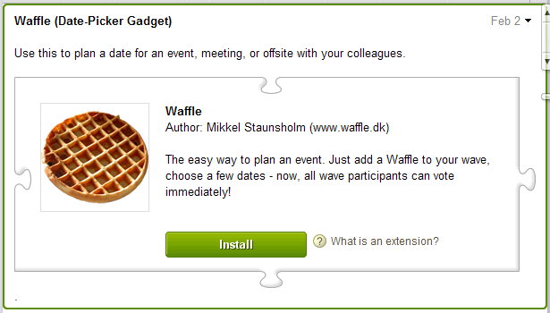
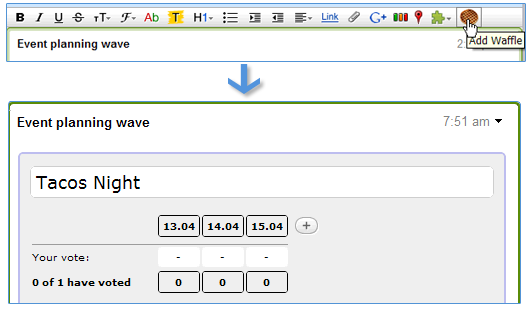

.. Licensed to the Apache Software Foundation (ASF) under one
   or more contributor license agreements.  See the NOTICE file
   distributed with this work for additional information
   regarding copyright ownership.  The ASF licenses this file
   to you under the Apache License, Version 2.0 (the
   "License"); you may not use this file except in compliance
   with the License.  You may obtain a copy of the License at

..   http://www.apache.org/licenses/LICENSE-2.0

.. Unless required by applicable law or agreed to in writing,
   software distributed under the License is distributed on an
   "AS IS" BASIS, WITHOUT WARRANTIES OR CONDITIONS OF ANY
   KIND, either express or implied.  See the License for the
   specific language governing permissions and limitations
   under the License.

Extensions
==========

Wave extensions are a way to augment the functionality of waves and the wave
client, and they often involve some combination of robots and gadgets.

What are wave extensions?
-------------------------

To use an extension, a user must first install it by interacting with an
extension installer in a wave. The installer gives information about the
extension so the user can decide whether to install it:

An extension can decorate the client in various ways, like by adding buttons to
the editing toolbar or items to the dropdown menu, and the user can trigger the
extension by clicking the toolbar button or menu item.

For example, the "Waffle" extension shown above adds a button to the editing
toolbar, and when the user clicks that button, a Waffle gadget is inserted in
the wave at the current position:

Extensions are described using an XML format called an Extension Installer
Manifest. To find out how to write an installer manifest, read the Developer
Guide.

As mentioned above, extensions often involve adding a robot or a gadget. Those
extension mechanisms are described here, and contrasted in more detail below:

* Robots: Robots are applications which can be added to waves as automated wave
  participants. Robot extensions commonly automate tasks, but can also
  participate in the wave as a participant, interacting with the conversation
  based on their capabilities. For more information, see the Wave Robots API
  Overview.
* Gadgets: Gadgets create a shared web application which runs within the wave,
  and to which all participants have access. For more information, see the Wave
  Gadgets API Developer Guide.

Which extension mechanism should I use?
---------------------------------------

When creating an extension, you often start by deciding whether you are writing
a robot, a gadget, or some combination of the two. You can use them together,
but they generally serve different purposes:

* A **robot** is an automated participant on a wave. Robots are programs which
  run on an application server and can modify state within the wave itself. A
  robot can read the contents of a wave in which it participates, modify the
  wave's contents, add or remove participants, and create new blips and new
  waves. Robots perform actions in response to events. For example, a robot
  might publish the contents of a wave to a public blog site and update the
  wave with user comments.
* A **gadget** is a small application that runs within a client. The gadget is
  owned by the wave, and all participants on a wave share the same gadget
  state. The only events a gadget responds to are changes to its own state
  object, and changes in the wave's participants (for example, participants
  joining or leaving the wave). The gadget has no influence over the wave
  itself. Wave gadgets typically aren't full blown applications, but small
  add-ons that improve certain types of conversations. For example, a wave
  might include a sudoku gadget that lets the wave participants compete to see
  who can solve the puzzle first.

The following table summarizes the differences between the various extension
options:

+--------------------------------------+---------------------------------------+
| Robot                                | Gadget                                |
+======================================+=======================================+
| Runs on application servers          | Runs within the wave client itself.   |
| (currently AppEngine) and interacts  |                                       |
| with the wave over a protocol.       |                                       |
+--------------------------------------+---------------------------------------+
| Each robot may instantiate at most   | Each gadget may have multiple         |
| one instance per wave. Remember that | instances per wave, one for each      |
| a robot is like a participant on a   | participant interacting with the      |
| wave, so each participant/robot is a | gadget.                               |
| unique instance, but a wave can have |                                       |
| many participants/robots.            |                                       |
+--------------------------------------+---------------------------------------+
| Robots may modify a wave and perform | Gadgets are not able to modify a wave,|
| the same operations as a human       | and have limited visibility into the  |
| participant.                         | wave. A gadget is only able to detect |
|                                      | changes in the wave's participants.   |
+--------------------------------------+---------------------------------------+
| Robots can modify a gadget.          | Gadgets have no way to know that a    |
|                                      | robot exists, and thus are not able   |
|                                      | to modify a robot.                    |
+--------------------------------------+---------------------------------------+

Details
-------

.. toctree::

   design_principals
   submission
   installers

