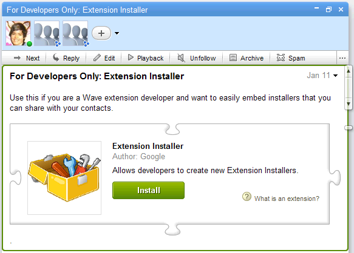
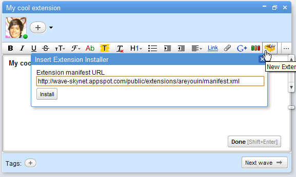
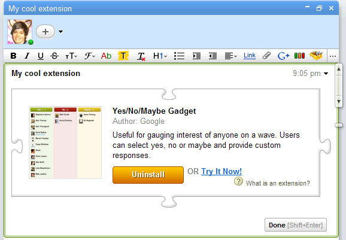

.. Licensed to the Apache Software Foundation (ASF) under one
   or more contributor license agreements.  See the NOTICE file
   distributed with this work for additional information
   regarding copyright ownership.  The ASF licenses this file
   to you under the Apache License, Version 2.0 (the
   "License"); you may not use this file except in compliance
   with the License.  You may obtain a copy of the License at

..   http://www.apache.org/licenses/LICENSE-2.0

.. Unless required by applicable law or agreed to in writing,
   software distributed under the License is distributed on an
   "AS IS" BASIS, WITHOUT WARRANTIES OR CONDITIONS OF ANY
   KIND, either express or implied.  See the License for the
   specific language governing permissions and limitations
   under the License.

Installers
==========

.. toctree::

What Is an Extension Installer?
-------------------------------

An extension installer is a package consisting of one or more of the following
parts:

* Extension metadata, which describes information about the extension including
  what it does, who created it and the current version.
* One or more hooks that describe how the extension interfaces with the client.
* Actions, which declare what happens when a hook is triggered, such as
  inserting gadgets or adding participants and robots.

You reference an extension installer through a special XML file, called the
Extension Manifest. You can add this extension manifest directly within the
Wave client to an existing or new wave, where it behaves according to the
extension's defined hooks and actions.

Extension Manifests
-------------------

Extension manifests are XML files that define how extensions hook into the
Google Wave Client and how they behave. Manifests contain three parts:
metadata, hooks, and actions. The metadata tells Google Wave how to render the
installer, hooks tell the client how and where the extension works within the
client, and actions define what happens when the extension is used.

For example, the following extension installer will add a toolbar icon to the
toolbar, and when that is clicked (the hook), it will insert a map gadget
(the action):

.. code-block:: xml

   <extension
       name="Map Gadget"
       thumbnailUrl="http://google-wave-resources.googlecode.com/svn/trunk/
            samples/extensions/gadgets/mappy/screenshot_mapgadget.png"
       description="Collaborate on a map of placemarks, paths, and shapes with
            other participants. Great for planning events and trips.">
     <author name="Google"/>
     <menuHook location="toolbar" text="Add Map Gadget"
         iconUrl="https://wave-api.appspot.com/public/images/insertMap.png">
       <insertGadget url="http://google-wave-resources.googlecode.com/svn/
            trunk/samples/extensions/gadgets/mappy/mappy.xml"/>
     </menuHook>
   </extension>

(View this installer XML in the browser, or a wave with this installer)

This simple manifest declares that a `<menuHook>` extension should be
installed on the wave client's toolbar by the statement `location="toolbar"`.
The `<menuHook>` tag also specifies a URL (iconUrl) for the icon to be added to
the toolbar. Then, the hook specifies a child action `<insertGadget>` that will
add the specified gadget to the wave upon initiation of the parent hook. You
may implement multiple hooks and actions for the same extension.

Extension Metadata
------------------

Before specifying hooks and actions, an extension installer first describes
various pieces of metadata. This information is primarily used for presenting
the extension to users, such as rendering the installer as an installable
puzzle piece in a wave.

The following attributes should be specified on the root `<extension>` tag:

* **name**: the display title of the extension
* **description**: about 2-3 sentences describing what the extension does - no
  more than 150 characters
* **infoUrl**: a link to the site or location providing more information about
  the extension.
* **thumbnailUrl**: an image, ideally 120*120px, which is displayed in the
  installer puzzle piece
* **version**: the current version fo the extension. The wave server uses string
  comparison for version checking, so version numbers do not have to
  numerically increase, and it assumes "0" if the version is not specified.

The author should be specified using `<author>` children tags, with name and
email attributes.

Extension Hooks
---------------

An extension *hook* defines how the extension hooks into a Google Wave client.
As such, the wave client is responsible for implementing the hook. In theory,
a hook could be implemented in different ways on different implementations of
Google wave clients.

Menu Hook
^^^^^^^^^

**menuHook** indicates that the extension should insert a UI element within a
menu in the wave client.

* **location**: where to hook into the client — supports the following values:

  * **toolbar** indicates that the extension should be placed within the wave
    client toolbar and will appear as an icon.

    .. image:: toolbar.png

  * **newwavemenu** indicates that the extension should be placed within the New
    Wave menu (as a suboption). New wave actions will create a wave
    automatically when clicked and all actions will subsequently act upon it.

    .. image:: newwavemenu.png

* **text**: specifies the text to display, which will show up as tooltip text if
  toolbar is specified as the extension's location, and will not be used
  otherwise.
* **iconUrl**: specifies a 20*20px image, which will be displayed on the editing
  toolbar if toolbar is the location.

For example, this menuHook adds a suboption to the "New Wave" menu, and when
the user installs and clicks the option, the client will create a new wave with
the two participants on it.

.. code-block:: xml

    <menuHook location="NewWaveMenu" text="New Friends Wave">
      <addParticipants>
        <participant id="jon@example.com"/>
        <participant id="tom@example.com"/>
      </addParticipants>
    </menuHook>

Regex Hook (Preview)
^^^^^^^^^^^^^^^^^^^^

**regexHook** indicates that the extension should be triggered when the wave
client finds a matching regular expression in the currently edited text. This is
useful for firing actions when text is matched. For example, a regex hook can
add a robot that processes matched content (e.g. emoticons, phone numbers, etc).

* pattern: the pattern to match against while the user is editing a blip.

For example, this regexHook searches for smiley faces, and when it finds one,
it prompts the user to add an emoticon robot:

.. code-block:: xml

    <regexHook pattern="\:\)">
      <addParticipants>
        <participant id="skimmy-wave@appspot.com"/>
      </addParticipants>
    </regexHook>

.. note::
    This hook is in preview mode and currently only enabled on
    WaveSandbox.com. We look forward to hearing your feedback on this
    hook in the forum.

Saved Search Hook
^^^^^^^^^^^^^^^^^

**savedSearchHook** adds saved searches when the extension is installed, and is
a special type of hook that does not actually get triggered by the user doing
something in the client. This hook is particularly useful for making it easy to
find waves associated with your extension, like those created by a robot
("with:your-bot@appspot.com").

* **name**: specifies the name of the search in the navigation panel.
* **query**: specifies the query to execute when the user selects the search.
* **color (optional)**: specifies a CSS-based html color attribute
  (e.g. #FF00FF or yellow), which becomes the background color of the
  search in the navigational panel, and the color of the label in the digest.

For example, this extension installs a saved search for unread waves:

.. code-block:: xml

    <extension name="Unread Wave Search"
        description="Installs a saved search that shows all unread waves.">
      <savedSearchHook name="Show unread" query="is:unread"
          color="#00FF00"/>
    </extension>

Extension Actions
-----------------

Each hook in turn defines one or more actions that act within a defined scope.
The following actions are supported:

Add Participants
^^^^^^^^^^^^^^^^

Adds participants to the current wave. Participants are specified via
participant child elements whose id attribute specifies the participant's wave
address.

For example, this extension creates a new wave with a chess playing robot.

.. code-block:: xml

    <menuHook location="NewWaveMenu" text="New Chess Match">
      <addParticipants>
        <participant id="chess-bot@googlewaverobots.com"/>
      </addParticipants>
    </menuHook>

Add Saved Search
^^^^^^^^^^^^^^^^

Similar to SavedSearchHook, adds a new saved search to the search menu. Note
that adding saved searches in this way will not automatically remove them when
the extension is uninstalled. See Saved Search Hook for a list of acceptable
attributes.

For example, this extension adds a saves search for chess games after the user
first uses the gadget.

.. code-block:: xml

    <menuHook location="toolbar" text="Add Chess Gadget"
        iconUrl="http://wave-chess.appspot.com/WaveChess.png">
      <insertGadget
          url="http://wave-chess.appspot.com/wavechess/com.google.wave.chess.
              client.ChessGadget.gadget.xml"/>
      <addSavedSearch title="Chess Game" query="has:gadget ChessGame"
          color="green"/>
    </menuHook>

Annotate Selection
^^^^^^^^^^^^^^^^^^

Applies an annotation to the current selection while in edit mode. The
annotation key and value is specified with key and value attributes,
respectively.

For example, this extension applies bold and strike-out styles to the
selected text:

.. code-block:: xml

    <menuHook location="toolbar" text="Boldicize">
      <annotateSelection key="style/fontWeight" value="bold"/>
      <annotateSelection key="style/fontStyle" value="italic"/>
    </menuHook>

For information about using this robot, read the Annotations section in the
documentation, and the Responding to User Selection article.

Insert Gadget
^^^^^^^^^^^^^

Inserts a gadget at the current cursor location. The gadget url is specified
via a url attribute.

For example, this extension inserts a chess gadget:

.. code-block:: xml

    <menuHook location="toolbar" text="Add Chess Gadget"
        iconUrl="http://wave-chess.appspot.com/WaveChess.png">
      <insertGadget
          url="http://wave-chess.appspot.com/wavechess/com.google.wave.chess
              .client.ChessGadget.gadget.xml"/>
    </menuHook>

Inserting Installers in Waves
-----------------------------

Once you've created the installer XML, you will want to actually test it out
and see how it works. To do that, you need to insert an installer element in
the wave, and before you can do that, you must install a special extension,
"Extension Installer Creator", that makes it easy to insert installer elements.

1. Install "Extension Installer Creator":

* If you're using Wave Sandbox, you can install the extension from this gallery
  wave.
* If you're using Wave Preview, you can install the extension from this gallery
  wave.

Once you're viewing the wave, just click "Install" on the installer.

2. Once you install the extension, you will see a toolbox on your editing
   toolbar while editing a blip. To insert an installer, click that toolbar
   icon, and paste the URL of your XML in the text box.

3. After clicking "OK", you will see an installer element in the wave, showing
   the information from your XML. If the installer does not load correctly,
   then check the XML and make sure that it is valid.

4. If you make changes to your installer XML and want to test the new XML, you
   will need to re-insert the installer with a random query parameter appended
   to the end of the URL, to avoid the wave using a cached copy of the XML. For
   more information on caching of installers, see this FAQ.

5. Once you're happy with the installer you can share it with your friends by
   adding them to the wave, or share it with the world by adding
   public@a.gwave.com to the wave. If you want to share it in the extensions
   gallery, then submit it here.

Examples
--------
The following are actual example installer XMLs that can show you how to use
the actions and hooks described above.

* Yes/No/Maybe:

  http://wave-skynet.appspot.com/public/extensions/areyouin/manifest.xml
  Installs an icon on the toolbar that inserts a gadget when clicked.
  Uses menuHook and insertGadget.
* Tricky:

  http://tricky-bot.appspot.com/installer.xml
  Installs a new option in the "New Wave" menu for creating trick-or-treating
  waves. Uses menuHook and addParticipant.
* Code Styler:

  http://google-wave-resources.googlecode.com/svn/trunk/samples/extensions/installers/code-styler/installer.xml
  Installs an icon on the toolbar that turns selected text into fixed width
  font. Uses menuHook and annotateSelection.
* Skimmy:

  http://google-wave-resources.googlecode.com/svn/trunk/samples/extensions/installers/regexhook/installer_skimmy.xml
  Installs a regex hook that prompts the user to add an emoticon bot when they
  type a smiley face. Uses regexHook and addParticipant.