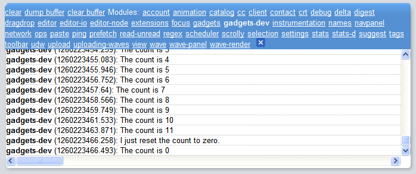

.. Licensed to the Apache Software Foundation (ASF) under one
   or more contributor license agreements.  See the NOTICE file
   distributed with this work for additional information
   regarding copyright ownership.  The ASF licenses this file
   to you under the Apache License, Version 2.0 (the
   "License"); you may not use this file except in compliance
   with the License.  You may obtain a copy of the License at

..   http://www.apache.org/licenses/LICENSE-2.0

.. Unless required by applicable law or agreed to in writing,
   software distributed under the License is distributed on an
   "AS IS" BASIS, WITHOUT WARRANTIES OR CONDITIONS OF ANY
   KIND, either express or implied.  See the License for the
   specific language governing permissions and limitations
   under the License.

Overview
========

Wave Gadgets: What's Different?
-------------------------------

Most of the gadgets written for non-Wave containers can run in Wave. However,
these gadgets are not able to take advantage of the live, multi-user
environment that is Wave. The main difference between Wave gadgets and non-Wave
gadgets is that a Wave gadget lives in a wave and can interact with the wave.
Wave-aware gadgets can:

* Access more granular state management
* Find out the current viewer and all of the other participants on the wave
* Work harmoniously with the Wave playback mechanism

Wave gadgets typically aren't full blown applications, but small add-ons that
improve certain types of conversations. For example, a wave might include a
gadget that lets wave participants vote on where to go to lunch.

Gadgets running in Wave belong to the wave they've been added to. This is
slightly different from orkut-like containers, where the gadgets sitting on a
profile page belong to the owner of that page. Consequently, any information
associated with the gadget is stored on a per-wave basis (actually stored in
the wave) rather than per-user. Gadget information and state are shared among
the participants of the wave. Note that unlike typical gadgets, gadgets within
Google Wave do not display a title. This allows the gadget to appear as part of
the conversation, rather than apart from it.

.. note::
   Wave does not currently support the OpenSocial API, but it supports a
   similar notion of roles. For details, see Roles.

Getting Started
---------------

At their core, social gadgets are XML files, sometimes known as gadget
specifications. Here is a simple "Hello World" gadget (hello.xml) that
illustrates the basic sections of a specification:

.. code-block:: xml

   <?xml version="1.0" encoding="UTF-8" ?>
   <Module>
     <ModulePrefs title="Hello Wave">
       <Require feature="wave" />
     </ModulePrefs>
     <Content type="html">
       <![CDATA[
          Hello, Wave!
       ]]>
     </Content>
   </Module>

In the "Hello World" example, you can see several sections that determine the
features and design of the gadget:

* <Module> indicates that this XML file contains a gadget.
* <ModulePrefs> contains information about the gadget and its author.
* <Require feature="wave" />  declares that the gadget has access to the Wave
  Gadgets API (see the reference for details). Wave also supports the
  JavaScript gadgets feature libraries listed in the gadgets XML reference:

  * setprefs
  * dynamic-height
  * settitle
  * tabs
  * minimessage
  * flash
  * locked-domain

  In your gadget, you include a separate <Require...> line for each feature
  library you want to use. For example:

  .. code-block:: xml

      <?xml version="1.0" encoding="UTF-8" ?>
      <Module>
      <ModulePrefs title="My Gadget">
       <Require feature="wave" />
       <Require feature="locked-domain" />
      </ModulePrefs>
        ...
      </Module>

  In particular, we recommend that you use locked-domain for security and
  dynamic-height to properly resize gadgets in a wave. Wave does not currently
  support the OpenSocial API.

* <Content type="html"> indicates that the gadget's content type is HTML. For
  more information, see the Gadgets API Developers Guide.
* <![ CDATA[…]]> contains the bulk of the gadget, including all of the HTML,
  CSS, and JavaScript (or references to such files). The content of this
  section should be treated like the content of the body tag on a generic HTML
  page.

Running a Gadget
----------------

You can write a gadget with any text editor. Once you write the gadget, you
must host it somewhere on the internet, where it is publicly visible (that is,
not behind a firewall). A few options for hosting are Google App Engine and SVN.

To add a gadget to a wave:

1. Place the cursor in the wave and click the More actions menu in the upper
   right corner of the wave. The More actions menu appears as an ellipsis (...).
2. In the More actions menu, click the Add Gadget by URL green puzzle piece
   icon:
3. In the Add gadget by URL dialog, type the URL for the gadget spec (in this
   example, http://gadget-doc-examples.googlecode.com/svn/trunk/wave/hello.xml)
   and click Add.

The "add by URL" feature is useful for testing gadgets during development. When
you are ready to share a gadget with users, you should install it in a wave to
make it easy to reuse and share. For details, see
Google Wave Extension Installers.

Gadget State
------------

One of the distinctive characteristics of Wave gadgets is their ability to set
state and to respond to state changes.

Gadgets may use the following states:

* Shared state is visible to all participants and synchronized for all
  participants.
* Private state is stored separately for every participant. The gadget can only
  see the private state of the viewer (the person looking at the gadget).

Shared State
^^^^^^^^^^^^

One of the types of state for Wave gadgets is called "shared state," because
the same state is shared by all participants on a wave.

Every Wave gadget has a shared state object, which is a map of key-value
strings. You can add arbitrary key-value combinations to this state object,
query it, update it, and implement callbacks in your gadget that will be
automatically triggered whenever the state object changes.

Not only is this gadget state shared among all Wave participants, but in the
typical case, any participant can change the gadget's state at any time. If
two users change values for different keys at the same time, the wave resolves
it. However, if the value for the same key is changed, only one change goes
through.

What does this mean for you as a Wave gadget developer? You should keep the
following in mind when you design your gadget:

* Since all wave participants use the same shared gadget state, your gadget
  should only expose state that is meaningful to everyone on the wave.
* Your gadget should be able to gracefully accommodate shared state changes
  coming in from multiple users simultaneously. Users may get into race
  conditions if they try to modify a value for the same key simultaneously,
  and one user's changes can supersede another's. A wave is a dynamic
  environment, and a Wave gadget should not rely on a fixed, predictable,
  linear state to function properly.

Private State
^^^^^^^^^^^^^

In addition to the shared state that can be accessed and modified by all
participants, Wave gadgets also have a private state. As opposed to the shared
state the information in the private state is stored separately for every
participant. The key-value pairs saved in the private state by a particular
participant can only be accessed if the gadget is loaded in a Wave client that
belongs to that participant. The private state makes it possible to hide
private information. For example, if a gadget implements a card game it may
save player's hand in the private state so that no other participant can fetch
this information even by analysing the raw Wave data in their client.

In all other aspects the private state works similarly to the shared state.

Gadget State Methods
^^^^^^^^^^^^^^^^^^^^

The following table lists the methods that are involved in creating a
state-aware gadget:

**setStateCallback(callback, opt_context)**
   Uses the passed callback parameter to define a callback function to be run
   when the gadget's shared state object changes. You can optionally specify an
   object (opt_context) to receive the callback. The setStateCallback()
   callback function is always called once when the state is first received by
   the gadget, and then subsequently whenever a new state is received by the
   gadget. See the section Structuring a Wave Gadget for more discussion of how
   to use setStateCallback().

**setPrivateStateCallback(callback, opt_context)**
   Uses the passed callback parameter to define a callback function to be run
   when the gadget's private state object changes. You can optionally specify
   an object (opt_context) to receive the callback. The
   setPrivateStateCallback() callback function is always called once when the
   private state is first received by the gadget, and then subsequently
   whenever a new private state is received by the gadget.

setParticipantCallback(callback, opt_context)
   Uses the passed callback parameter to define a callback function to be run
   when there is a change to the participants of the wave in which the gadget
   resides. This includes participants getting loaded when the gadget first
   runs, participants joining or leaving the wave, or changes to a
   participant's information, such as a name change. This does not include a
   participant performing an operation within the wave.

   You can optionally specify an object (opt_context) to receive the callback.

getState()
   Returns the gadget's shared state object, which conceptually is a key-value
   map. Once you have the state object, you can perform operations on it like
   querying for the value of particular keys. For example,
   wave.getState().get('count') returns the value for the count key. Note that
   both keys and values must be strings.

getPrivateState()
   Returns the gadget's private state object, which is similar to the shared
   state object, but contains key-value pairs for the private gadget state.

submitDelta(delta)
   Updates the state object with delta, which is a map of key-value pairs
   representing an update. For example,
   wave.getState().submitDelta({'count': 5}) or
   wave.getPrivateState().submitDelta({'count': 5}) sets the value of the count
   key to '5' in respectively shared or private state. Note that all
   participants will see the update in the shared state, but the update in
   private state will only be visible to the viewer.

Your custom callbacks
   The final piece of the puzzle is the custom callback functions you implement
   that are invoked when there are changes to the wave's state object or
   participants. These callbacks are specified as arguments to the
   setStateCallback(), setPrivateStateCallback(), and
   setParticipantCallback() methods.

Structuring a Wave Gadget
^^^^^^^^^^^^^^^^^^^^^^^^^
The effective operation of a Wave gadget depends on the state and participant
objects being available and up-to-date when you access them. To ensure this, we
recommend that you follow these guidelines in structuring your Wave gadget:

* Don't access the participant or state objects in init(). Most Wave gadgets
  include an initialization function that is called when the gadget loads. In
  the examples in this document, this function is called init(). You use this
  function to confirm that the wave is live and to register your callbacks.
  You should not attempt to access the participant or state objects in init().
  The participant and state objects do not have a meaningful value until their
  respective callbacks (setParticipantCallback() and setStateCallback()) have
  fired.
* Modify the state object when a UI element submits an event. This is a design
  suggestion, not a hard and fast rule. But if you're creating an interactive
  gadget, it's likely that you'll use a user interface (UI) element like a
  button to capture user input. When the UI element submits an event, that is a
  good place in your code to modify the state object.
* Put your programming logic inside of callbacks. Once you modify the state
  object, wait until you receive notification about the changes before
  rendering them in your gadget's UI. In other words, you should implement the
  bulk of your program logic inside of callbacks. Callbacks are are triggered
  when there is a change in the state object (setStateCallback()) or a change
  in the wave's participants (setParticipantCallback()). Putting your program
  logic inside callbacks ensures that you get the latest changes.

Here is a simple example that illustrates how to structure a Wave gadget.
This gadget has a single key, count. The callback function stateUpdated()
refreshes the gadget display whenever a wave participant clicks the button and
thereby increments the value for count.

This is how the sample gadget is structured:

* gadgets.util.registerOnLoadHandler(init) designates init() as the function to
  be called when the gadget first loads. It is called init() in this example,
  but it could be called anything.
* The init() function simply confirms that the wave is live and calls
  wave.setStateCallback(stateUpdated). The bulk of the gadget's program logic
  is in the stateUpdated() callback. For an example of using
  setParticipantCallback(), see the auction gadget.
* The buttonClicked() function is called when a wave participant clicks the
  gadget's "Click Me!" button. It is in this function that the state object is
  modified.
* The gadget UI isn't updated to reflect the state change inside of
  buttonClicked(). The UI is updated in the callback stateChanged(). Remember
  that callbacks aren't triggered until the objects they refer to have changed,
  so updating the UI inside the callback ensures that you pick up the latest
  changes.

Here is the sample gadget. Remember that as described in Shared State, if two
participants try to increment the count at the same time, only one of the
changes will go through.

.. code-block:: xml

   <?xml version="1.0" encoding="UTF-8" ?>
   <Module>
   <ModulePrefs title="State Example" height="120">
     <Require feature="wave" />
   </ModulePrefs>
   <Content type="html">
   <![CDATA[
   

       
       <input type=button value="Click Me!" id="butCount" onClick="buttonClicked()">
       <input type=button value="Reset" id="butReset" onClick="resetCounter()">
     ]]>
     </Content>
   </Module>

Auction Gadget
--------------

The example shown above simply increments a counter when a button is clicked.
It does not distinguish between wave participants. This example in this section
goes one step further: it compares the input of multiple wave participants and
updates the gadget state accordingly. In this section we'll build a gadget that
turns a wave into an auction.

Managing Participants
^^^^^^^^^^^^^^^^^^^^^

Waves are hosted live conversations between multiple participants. Each
participant can have the wave open, and can even have one wave open in multiple
windows. Gadgets in a wave are instantiated once each time the wave is opened.
Shared state ensures that each of those gadgets shows the same thing. But the
participants on the wave are often important to the gadget too. Gadgets can get
a list of all the participants on the wave (whether they have the gadget open
or not) and the viewer. The viewer is the user on whose wave client the
particular instance of the gadget is running.

For the auction scenario, the list of all participants represents the group of
people from whom we expect bids. We can use this list to go from the ID of the
current highest bidder to the name and avatar of the highest bidder. The viewer
is the person that does the bidding in a particular instance.

When a viewer enters a bid and clicks the button to submit it, the viewer's ID
and bid are stored as a key-value pair. Thus they become part of the gadget
state:

.. code-block:: javascript

   function buttonClicked() {
     var viewerId = wave.getViewer().getId();
     var state = wave.getState();
     var bid = parseInt(document.getElementById('yourBid').value);
     var currentBid = parseInt(state.get(viewerId, '0'));
     if (bid > currentBid) {
       delta = {};
       delta[viewerId] = bid;
       state.submitDelta(delta);
     }
   }

Processing Bids
^^^^^^^^^^^^^^^

Once a bid is submitted, it must be compared against the bids submitted by
other participants. The auction gadget maintains a list of bids for an item.
This list includes the bid amount and the user that submitted the bid. Every
time the state is updated, the gadget needs to recalculate the highest bid and
update the gadget display.

In the **init()** function that executes when the gadget is loaded, the gadget
specifies two callback invocations:

* **wave.setStateCallback()** -- Sets the gadget state update callback.
* **wave.setParticipantCallback()** -- Sets the participant update callback.
  In this example, it's used to keep track of how many participants are on the
  wave.

.. code-block:: javascript

   function init() {
     if (wave && wave.isInWaveContainer()) {
       wave.setStateCallback(renderInfo);
       wave.setParticipantCallback(renderInfo);
     }
   }
   gadgets.util.registerOnLoadHandler(init);

The auction gadget tracks the state of a single key-value pair: the viewer ID
of each wave participant who submits a bid, and the participant's bid. Both
**wave.setStateCallback()** and **wave.setParticipantCallback()** invoke the
same callback, **renderInfo()**. This function compares all of the bids that
have been submitted and calculates the highest bid. It displays the current
highest bid, along with the user that submitted it.

.. code-block:: javascript

   function renderInfo() {
     if (!wave.getState()) {
       return;
     }
     var highestBid = 0;
     var highestBidderId = null;
     var state = wave.getState();
     var keys = state.getKeys();
     for (var i = 0; i < keys.length; ++i) {
           var bidder = keys[i];
           var bid = parseInt(state.get(bidder));
           if (bid > highestBid) {
             highestBid = bid;
             highestBidderId = bidder;
           }
         }
     var bidderName = 'Nobody';
     var thumbNail = 'http://gadget-doc-examples.googlecode.com/svn/trunk/images/unknown.gif';
     if (highestBidderId) {
       bidderName = highestBidderId;
       var participants = wave.getParticipants();
       var numPeople = participants.length;
       if (participants) {
         for (var i = 0; i < participants.length; ++i) {
           if (participants[i].getId() == highestBidderId) {
             var highestBidder = participants[i];
             bidderName = highestBidder.getDisplayName();
             if (!bidderName) {
               bidderName = highestBidder.getId();
             }
             thumbNail = highestBidder.getThumbnailUrl();
           }
         }
       }
     }
     document.getElementById('bidderThumbnail').src = thumbNail;
     document.getElementById('bidderName').firstChild.nodeValue = bidderName;
     document.getElementById('highestBid').firstChild.nodeValue = highestBid;
     document.getElementById('yourBid').value = highestBid;
     document.getElementById('participants').firstChild.nodeValue = numPeople;
   }

Tying it together
^^^^^^^^^^^^^^^^^

Here is the complete source for the auction gadget.
The main thing not covered in this tutorial is playback. You get a basic
version "for free" since for each playback, the system will load the state for
the gadget and let the gadget render itself. As you might expect, playback of
an auction displays who bid what and in what order.

A few tools that may help you in developing Wave gadgets are JQuery and Firebug.

WaveSandbox.com does not cache gadgets, so changes you make to the source are
reflected in running versions of the gadget as soon as you reload the wave.
You can reload the wave simply by clicking on another wave and then returning
to the wave containing the gadget. Note: Wave Preview does cache gadgets, so
you will need to specifically disable the cache when debugging there. See the
FAQ for more info.

.. code-block:: xml

   <?xml version="1.0" encoding="UTF-8" ?>
   <Module>
   <ModulePrefs title="Wave Bidding" height="250">
     <Require feature="wave-preview" />
     </ModulePrefs>
     <Content type="html">
    <![CDATA[

     
     
      
     Nobody 
     Highest bid: 0 
     Your bid: <input id="yourBid" size="5" value="0"><button id="butCount"
         onclick="buttonClicked()">Bid</button> 
     Number of wave participants: 1 

     ]]>
     </Content>
   </Module>

Using the Debug Log
-------------------

The Google Wave sandbox client comes with its own debug log, which you can use
to monitor changes in the gadget state. Note that the debug log is only
available in the sandbox.

To log messages to the Wave debug log, use the wave.log() method. For example:

.. code-block:: javascript

   wave.log("The count is " + wave.getState().get('count'));

To enable the debug log:

1. Insert ?ll=debug at the end of the Wave URL.
2. Reload the page.
3. Choose **Debug > Show debug log**.

The debug log appears at the bottom of the window. To filter the output to show
wave.log()messages, click gadgets-dev. To filter the output to show
Wave-generated gadgets messages, click gadgets. The gadgets and gadgets-dev
options only appear if the current wave contains a gadget. You can clear or
close the debug log at any time.

To learn more, see the article Debugging Wave Gadgets.

Roles
-----

To design successful Wave gadget, it's important to understand the roles that
apply to a gadget running in the Wave environment.

.. note::
   Currently, Wave does not support the OpenSocial API. However, it includes
   similar social network concepts like owner, viewer, and friends.

This table summarizes Wave roles:

Roll( Wave Method Call) - Description

gadget(owner)
   No programmatic access at this time. The wave that contains the gadget is
   the gadget's owner, not the user who added the gadget.

gadget owner's friends (wave.getParticipants())
   Returns the wave's participants.

gadget viewer( wave.getViewer())
   Returns an object representing the user that is viewing the wave.

host (wave.getHost())
   The participant who added this gadget to the blip. Note that the participant
   may no longer be on the wave.

Profile Data
^^^^^^^^^^^^

Wave doesn't support the notion of profiles as such. However, you can retrieve
a participant's ID, display name, and thumbnail URL as follows:

* wave.Participant.getId()
* wave.Participant.getDisplayName()
* wave.Participant.getThumbnailUrl()

Wave UI Library (Experimental)
------------------------------

As a developer writing gadgets for google wave, you'll want your gadgets to
look as well integrated with the rest of wave as possible. However since your
gadget runs in its own iframe, it doesn't by default inherit the look and feel
of wave, nor does the gadget have access to the widgets that wave uses for
buttons and panels.

To help with this, the wave gadget feature comes with a utility library called
wave.ui. At its most basic, this library lets you import a style sheet that
defines the default look & feel of wave with this one-liner:

.. code-block:: javascript

   wave.ui.loadCss();

The library also contains three other methods: **makeButton**,
**makeFrame**, and **makeDialog**. Each of these take a target DOM element and
convert it into a wave-styled element - a button, frame, or dialog,
respectively.

For example, let's say that we want to create a wave-styled button. First, we
define the DOM element, which must be an anchor (<a>) for buttons:

.. code-block:: html

   <a id="mybutton" href="#" OnClick="alert('hello world');">Click me</a>

Then, during the initialization of the gadget, we call the makeButton method to
convert this anchor into a nice looking button:

.. code-block:: javascript

   wave.ui.makeButton(document.getElementById('mybutton'));

.. note::
   Since this method operates on a DOM element, it expects the DOM element to
   exist. You should wait until the body loads by using
   **gadgets.util.registerOnLoadHandler()**.

For more information, consult the Wave Gadgets API Reference.