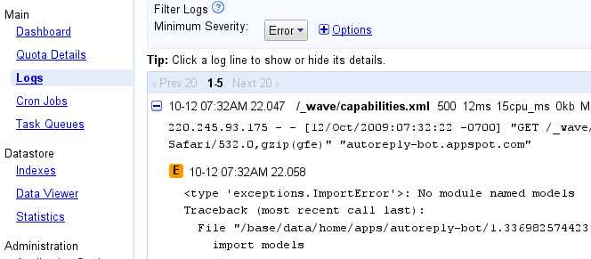
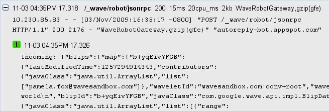
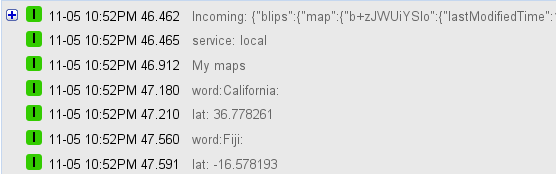
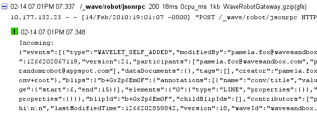
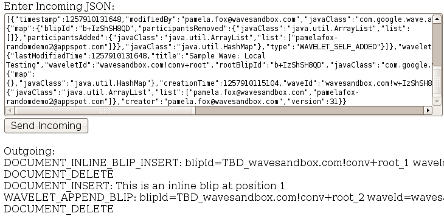

.. Licensed to the Apache Software Foundation (ASF) under one
   or more contributor license agreements.  See the NOTICE file
   distributed with this work for additional information
   regarding copyright ownership.  The ASF licenses this file
   to you under the Apache License, Version 2.0 (the
   "License"); you may not use this file except in compliance
   with the License.  You may obtain a copy of the License at

..   http://www.apache.org/licenses/LICENSE-2.0

.. Unless required by applicable law or agreed to in writing,
   software distributed under the License is distributed on an
   "AS IS" BASIS, WITHOUT WARRANTIES OR CONDITIONS OF ANY
   KIND, either express or implied.  See the License for the
   specific language governing permissions and limitations
   under the License.

Debugging
=========

A Wave robot is, when it comes down to it, an event listener: it listens to
events on a Waves, and reacts accordingly. So, when you are debugging a robot,
the problems you run into usually involves a robot failing to respond to an
event, or responding in an unexpected manner. It can be a bit tricky to debug
robots, since their code lives on a server and the Wave-Robot communication is
fairly hidden, so this article aims to give you tips for debugging.

.. toctree::

Checking Initial Robot Setup
----------------------------

When you create a Wave robot on App Engine, you are really creating a web
server that contains a few necessary files and a web service for responding to
events (JSON-RPC). So, when you first deploy a robot to your App Engine domain,
you should check that the URL paths are all setup correctly.

Capabilities XML
^^^^^^^^^^^^^^^^

The capabilities file is parsed by Wave every time a robot is added to a wave,
and it contains information on the registered events, and robot version. The
capabilities file should be automatically generated for you when using the Java
or Python client libraries, and the <version> should be automatically changed
to a new hash value whenever you add or remove an event. For more information,
see Inspecting Robot Capabilities in the developer's guide.

It is always served from this URL:

http://yourappid.appspot.com/_wave/capabilities.xml

When you load that URL, you should see a well-formed XML file, with events that
correspond to the ones you registered in your code. The example below shows a
robot named "Exporty" that responds to three events, and is automatically
subscribed to the error event.

.. code-block:: xml

  <w:robot xmlns:w="http://wave.google.com/extensions/robots/1.0">
  <w:version>0x74e2d13</w:version>
  <w:capabilities>
    <w:capability name="OPERATION_ERROR"/>
    <w:capability name="BLIP_SUBMITTED"/>
    <w:capability name="WAVELET_PARTICIPANTS_CHANGED"/>
    <w:capability name="WAVELET_SELF_ADDED"/>
  </w:capabilities>
  </w:robot>

JSON-RPC Service
^^^^^^^^^^^^^^^^

When Wave wants to send a message to your robot, it will send an HTTP POST to a
URL on your server with a JSON message describing the event and attached data.
The client libraries then turn that JSON into Python/Java classes for you to
operate on.

That service is located at this URL:

http://yourappid.appspot.com/_wave/robot/jsonrpc

When you load that URL in a browser, you should see a blank page. The page
should exist, but output nothing. If there is an error, you should check your
App Engine logs.

Using Wave as a Log
-------------------

When debugging, the first thing we developers usually try to discover is a way
to log out messages in our respective environments. Since a Wave is just a
series of messages, you can use it as a log (at least during development). The
easiest way to do this is to add a blip with the desired message to the current
Wave.

In Python, you can write an addBlip() function, and then call it from your
robot callbacks:

.. code-block:: python

  def addBlip(wavelet, string):
    wavelet.reply(string)

  def OnRobotAdded(event, wavelet):
    addBlip(wavelet, "Just Testing")

In Java, the equivalent code would look like this:

.. code-block:: java

  public void makeDebugBlip(Wavelet wavelet, String text) {
    wavelet.reply(string);
  }

  public void OnRobotAdded(WaveletSelfAddedEvent e) {
    makeDebugBlip(e.getWavelet());
  }

Remember that you will not want to append debug blips to a Wave when actual
users are looking at it. You can decide either to only use this style of
debugging when you're in pre-release development, or to protect the debug
logging behind a boolean.

Using App Engine Logs
^^^^^^^^^^^^^^^^^^^^^

For each of your apps, App Engine keeps a history of system logs in the
dashboard. To view the logs from your deployed robot, sign into
appengine.google.com, go to the dashboard for your app ID, and click Logs in
the sidebar. App Engine distinguishes between various types of logs, and lets
you filter based on the type. There are several types that are the most useful
for debugging Wave robots.

Error Logs
^^^^^^^^^^

To begin with, App Engine will log any errors that halt execution of your robot
as type Error. If your robot isn't working as expected, the first thing you
should do is check the logs. Here's a screenshot of an error log:

Robot Logs
^^^^^^^^^^

In addition, the Wave robot client libraries will, by default, log all the
incoming and outgoing JSON events/operations messages as type Info. Here's a
screenshot of some logged messages:

Custom Logs
^^^^^^^^^^^

On top of that, developers can log their own messages to this history, by
using the respective logging libraries in each of the SDKs. This can be a nice
alternative or supplement to the technique mentioned earlier of logging within
Wave.

In Python, you can import the logging module and use the method corresponding
to the desired severity level (e.g. Info):

.. code-block:: python

  import logging

  def logString(string):
    logging.info(string) // Level: "Info"

In Java, you do something similar:

.. code-block:: java

  import java.util.logging.Logger;

  private static final Logger log = Logger.getLogger(MyServlet.class.getName());

  public void logString(String string) {
    log.info(string);
  }

You also need to set up the logging.properties file. For more information, see
the Logging section in the Java App Engine documentation.

Now, after you deploy and use your robot, you can find your custom messages in
the logs. Here's a screenshot of some custom logging:

Local Debugging
---------------

Normally, when you are developing an App Engine app, you can test it using the
local development server, and then only upload it when you're confident that
it's working well. Unfortunately, that is not the case when you're creating a
Wave robot, as the Wave server can only interact with robots that are deployed
on a publicly available server. Every time you make a change to your robot and
you want to see if it worked, you need to redeploy the robot to your server.
This need for redeployment can result in alot of uploads when you're developing
your robot, and potentially going over the App Engine daily upload limit (250).

Even though you cannot use locally deployed robots on Wave servers, it is
possible to create a local service that mocks the calls that Wave sends to your
robot. You can do this by creating an HTML page on your server that can send an
XMLHTTPRequest to your local JSON-RPC service with mock JSON data, and output
the resulting response.

To set this up, first copy this mocking framework file to your server
(localdebug.html):

.. code-block:: html

    <html>
    <head>
    
    
    </head>

    <body>
      Enter Incoming JSON: 
      <textarea id="incoming" cols=50 rows=20></textarea> 
      <button onclick="sendIncoming()" id="runOps">Send Incoming</button>
        
      

Outgoing:

    </body>
    </html>

Then, make sure that your app will serve the file.

If using the Python SDK, add the following to your app.yaml:

.. code-block:: json

  - url: /localdebug.html
    static_files: localdebug.html
    upload: localdebug.html
    mime_type: text/html

If using the Java SDK, just make sure the file is in your "/war" folder.

Start your server locally, following the instructions for the Python SDK or
Java SDK.

Visit the HTML page on the server:

http://localhost:8080/localdebug.html

The page contains a text field, a button, and a 
 for the output. To use
this page, you need to enter a JSON message of incoming events, press the
button, and inspect the formatted output to see that it's done what you
expected (and not encountered any errors along the way. The easiest way to find
a JSON message of incoming events is to copy them from your App Engine logs. As
long as you have deployed and used your robot in Wave already, your logs will
contain usable data.

Visit appengine.google.com, select your app ID, and then click Logs in the
sidebar. By default, App Engine displays logs of a minimum severity of Error.
Click Minimum Severity > Info to find the JSON-RPC logs. At each timestamp,
you should see two Info level logs. The first will say "Incoming: " next to a
large JSON data object, and the second will say "Outgoing:" next to a smaller
JSON data object. Here's a screenshot of the "Incoming: " log:

When you have located the JSON messages, you can copy and paste the incoming
JSON into the text field, submit that, and see that the Outgoing events are
what you expected. If you don't see a response, your robot may have produced an
error while executing. Check the HTTP response or the running output from the
local server to find the error. Here's a screenshot of the page in action:

If you use this page in combination with local logging (outputted to the
command line), you can work out the functionality of your robot without always
having to deploy it to the server.

Catching Errors Earlier
-----------------------

Another way to avoid having to upload excessively to the live server is to make
sure you catch your coding errors earlier. At a basic level, this means making
sure that your code doesn't have typos and imports the correct libraries. The
easiest way to do this is to use an IDE that will constantly check your code
for syntax errors.

We recommend using Eclipse with both the Python and Java SDKs, as it is a free
open-source SDK that can be used in conjunction with several useful plugins.
If you're developing in Java, you should use the official Google Eclipse
plugin. If you're developing in Python, you can download PyDev, a third-party
open-source plug-in. When you create a new project, you can specify that you
want to create a "Google App Engine" project, and then add your code to the
blank project.

If for some reason you do not want to use Eclipse for development, you should
use other available tools to check the validity of your code. If you're
developing in Java, you can send the code through the compiler first. If you're
developing in Python, you can download pylint, and run that on your code to
catch basic syntax, indentation, and variable scope errors.

Conclusion
----------

You may find yourself using only some of these suggestions, using all of them,
or coming up with your own variations. If you are still unable to debug your
robot with these techniques, you may want to check the issue tracker for known
robot issues, to make sure your robot is not experiencing them, and of course,
you can ask for help in the forum. To help other developers debug your code,
you may want to put it online in a code repository or using a service like
pasties.

Please share any of your own ideas for debugging robots in the forum. We would
love to hear from them, and use them to make robot development an enjoyable
experience.