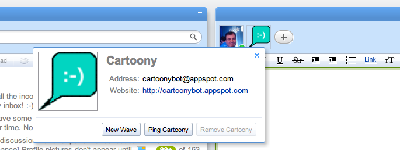

.. Licensed to the Apache Software Foundation (ASF) under one
   or more contributor license agreements.  See the NOTICE file
   distributed with this work for additional information
   regarding copyright ownership.  The ASF licenses this file
   to you under the Apache License, Version 2.0 (the
   "License"); you may not use this file except in compliance
   with the License.  You may obtain a copy of the License at

..   http://www.apache.org/licenses/LICENSE-2.0

.. Unless required by applicable law or agreed to in writing,
   software distributed under the License is distributed on an
   "AS IS" BASIS, WITHOUT WARRANTIES OR CONDITIONS OF ANY
   KIND, either express or implied.  See the License for the
   specific language governing permissions and limitations
   under the License.

Identities & Profiles
=====================

This page introduces some robot basics, such as how robots are set up, where
they are hosted, and how they are identified to the Google Wave clients.
Additionally, we discuss how a robot's capabilities serve as a specification of
what the robot can do, and how meta-information is attached to a robot via its
profile.

.. toctree::

Robot Identity
--------------

Google Wave currently supports robots built using Google App Engine. App Engine
identifies web applications using an application.appspot.com web address. When
you create robots using App Engine, you also implicitly define an HTTP
interface using the base http://application.appspot.com URL. Google Wave uses
this address when communicating with the robot (and this address implicitly
defines a robot).

The Java and Python client libraries allow you to design your robot without
having to worry about handling and managing the individual HTTP requests which
make up the Wave Robot HTTP Protocol. Although the particulars of the protocol
may change as the Wave API evolves, the client libraries have been designed to
be fairly stable.

A user or an extension can add a robot to a wave (just like any other
participant), using the robot's App Engine application ID followed by
@appspot.com as its wave address. For instance, if the App Engine application
ID for a robot is parrotybot, the robot's wave address is
parrotybot@appspot.com. Note that the robot is added by its wave address,
although the Wave API uses an HTTP mechanism to contact the robot.

.. note::
   We now allow robots to be built and deployed on Non-App Engine hosts.
   However, at this time, non-App Engine robots can only run on WaveSandbox.com.

Robot Profiles
--------------

Robots may additionally provide meta-information (known as a profile), which
identifies a robot to other users (and other robots). Information within this
profile is shown within a profile card when you click on the robot's avatar:

A profile consists of the following information:

* name specifies the human-readable name of the robot. This name will be
  displayed wherever you hover over the robot's avatar or display its profile
  card.
* imageUrl specifies the URL that references the robot's avatar image. Image
  dimensions of 100 x 100 pixels are recommended for this image.
* profileUrl specifies the URL where the robot profile is available. This URL
  can be any URL you wish and it will be linked within the profile card.

Defining a profile differs depending on whether you're using the Python or Java
client libraries. For developers in Python, you define profile information
within your robot's constructor:

.. code-block:: python

    # Note that the first argument indicates the robot's name.
    samplebot = robot.Robot(
        'Sample Robot',
        image_url='http://sample-bot.appspot.com/static/icon.png',
        profile_url='http://code.google.com/apis/wave/')

Developers using the Java client library will instead implement three methods
on the abstract robot class to return profile information:

* getRobotName()
* getRobotProfileUrl()
* getRobotImageUrl()

.. code-block:: java

   public class SampleBotServlet extends AbstractRobot {

     @Override
     protected String getRobotName() {
       return "Sample Robot";
     }

     @Override
     protected String getRobotAvatarUrl() {
       return "http://sample-bot.appspot.com/static/icon.png";
     }

     @Override
     protected String getRobotProfilePageUrl() {
       return "http://code.google.com/apis/wave/";
     }
   }

If a profile is available for a robot, it will be accessible at the following
address:

robotName.appspot.com/_wave/robot/profile

Sending an HTTP GET request to this address will return JSON containing the
robot's profile properties:

.. code-block:: json

   {
     "name": "Sample Robot",
     "imageUrl": "http://sample-bot.appspot.com/static/icon.png",
     "profileUrl": "http://code.google.com/apis/wave"
   }