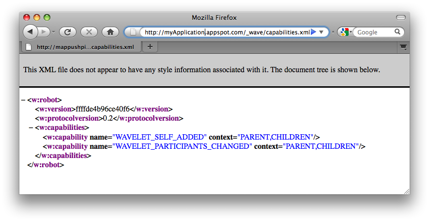

.. Licensed to the Apache Software Foundation (ASF) under one
   or more contributor license agreements.  See the NOTICE file
   distributed with this work for additional information
   regarding copyright ownership.  The ASF licenses this file
   to you under the Apache License, Version 2.0 (the
   "License"); you may not use this file except in compliance
   with the License.  You may obtain a copy of the License at

..   http://www.apache.org/licenses/LICENSE-2.0

.. Unless required by applicable law or agreed to in writing,
   software distributed under the License is distributed on an
   "AS IS" BASIS, WITHOUT WARRANTIES OR CONDITIONS OF ANY
   KIND, either express or implied.  See the License for the
   specific language governing permissions and limitations
   under the License.

Java Tutorial
=============

The easiest way to understand how Wave extensions work is to build a Wave
robot. Robots are applications that interact with a Wave through the Wave
protocol (HTTP interface). Currently, we only support robots hosted with Google
App Engine. In the future, we will support any client architecture that
implements the Wave protocol.

In this tutorial, we'll use the Java client library to develop a sample robot.
(The concepts apply here equally well to users of the Python client library,
though implementation details will be different.) In this brief tutorial, you
will create a simple robot, upload it to App Engine, and see it working with
Wave.

Before you get started, make sure you have the Java 6 development kit
installed. You can determine if you have Java installed (and what version is
installed) by executing the following command from the command line:

.. code-block:: bash

   hostname$ java -version
   java version "1.6.0_07"
   Java(TM) SE Runtime Environment (build 1.6.0_07-b06-153)
   Java HotSpot(TM) 64-Bit Server VM (build 1.6.0_07-b06-57, mixed mode)

.. note::
   to enable Java 6 on Mac OS X, you may need to set Java 6 as the default
   using the /Applications/Utilties/Java/JavaPreferences application.

The Java Client Library
-----------------------

Development of Google Wave robots requires compiling with a client library.
This tutorial uses the Java client library and some other auxiliary libraries
for communication and authentication. You can download these libraries from the
Wave Robot Java Client Library home page on Google Project Hosting:

http://code.google.com/p/wave-robot-java-client/

A Python client library is also available.

Setting Up App Engine
---------------------

You can develop Wave robots and other Java web applications for App Engine
using your favorite Java development tools. The Google Plugin for Eclipse
makes it especially easy to develop App Engine applications with the Eclipse
IDE. The Plugin includes the App Engine Java SDK, and adds several features to
Eclipse for creating, testing and uploading projects.

Registering Your Application with App Engine
^^^^^^^^^^^^^^^^^^^^^^^^^^^^^^^^^^^^^^^^^^^^

You will also want to register your robot using an Application ID at
https://appengine.google.com. You are allowed to register up to 10 application
IDs, and application registrations cannot be undone or deleted, nor can an
application ID be changed after it is registered. If you wish to conserve your
allotted application registrations, you may want to choose an application ID
you know you will use for a future project. As well, you may wish to reserve
one ID for testing purposes of your robots.

Go to the App Engine Administrator Console in your web browser. Sign in using
your Google account, creating one if necessary. If you haven't used this
account with App Engine before, you may also be prompted to verify your account
using SMS and a mobile phone.

Under My Applications click the Create an Application button. Choose an
application ID, and follow the prompts to complete the registration. The new
application appears in the list. You can click its name to visit the
Administrator Console for this application.

Setting Up Eclipse
^^^^^^^^^^^^^^^^^^

To keep things brief, this tutorial assumes you are using Eclipse and the
Google Plugin. All of the Plugin's features are also provided by the App Engine
SDK as Apache Ant build tasks, and as command-line tools and Java classes. If
you'd prefer not to use Eclipse or the Plugin, see the App Engine Java
documentation for alternatives.

Download and install Eclipse from the Eclipse website. Be sure to get the Java
EE bundle, which includes several useful features for web application
development.

You can install the Google Plugin and the App Engine SDK using the Software
Update feature of Eclipse.

If you are using Eclipse 3.5 (Galileo), use the following Software Update
location:

http://dl.google.com/eclipse/plugin/3.5

If you are using Eclipse 3.4 (Ganymede), use the following Software Update
location:

http://dl.google.com/eclipse/plugin/3.4

Select the Plugin and the App Engine SDK from the list of available software,
then install. For more information on installing the Google Plugin for Eclipse,
see the Google Plugin for Eclipse documentation and the App Engine docs for the
Plugin.

Create a new App Engine project, as follows:

1. Select File > New > Web Application Project. Alternatively, click the New
   Web Application Project button in the toolbar:  The New Web Application
   Project button.
2. The "Create a Web Application Project" wizard opens. For "Project name,"
   enter a name for your project, such as Parroty. For "Package," enter an
   appropriate package name, such as parroty.
3. Since we're not going to use Google Web Toolkit for this project, uncheck
   "Use Google Web Toolkit." Verify that "Use Google App Engine" is checked.
4. Click Finish to create the project.

The wizard creates a directory structure for the project, including a src/
directory for Java source files, and a war/ directory for compiled classes and
other files for the application, libraries, configuration files, static files
and other data files. The wizard also creates a servlet source file and two
configuration files. The complete directory structure looks like this:

::

   Parroty/
     src/
       parroty/
         server/
           ParrotyServlet.java
       META-INF/
         jdoconfig.xml
       log4j.properties
       logging.properties
     war/
       WEB-INF/
         lib/
           ...App Engine JARs...
         appengine-web.xml
         web.xml
       index.html

For more information on getting started with App Engine, see the App Engine
Getting Started Guide for Java.

Hello, Robot!
-------------

To make this app into a robot, we need the Java robot application library from
the Wave API SDK. We also need several addiitional libraries, also included
with the SDK. These libraries are provided by the following JARs:

* **wave-robot-api.jar**: The core robot API.
* **wave-model.jar**: Models the components of a wave as classes.
* **gson.jar**: Converts JSON into Java objects, and vice versa.
* **oauth.jar**: Helps register the robots with OAuth.
* **commons-codec.jar**: Computes OAuth-related information.

Copy these files from the SDK to the following directory in your project:

*Parroty/war/WEB-INF/lib/*

Refresh the project by selecting the File menu > Refresh. Select the
Project menu > Properties, then in the Properties window, select the
"Java Build Path" category. Click the "Libraries" tab, then click the Add
JARs... button. Navigate to and select the new JARs, then click OK. Click OK to
close the Properties window.

Event Handing
^^^^^^^^^^^^^

To implement the main event handler, create a servlet that extends the
AbstractRobot class (from the com.google.wave.api package). This abstract class
requires that you override and implement a few methods. Additionally, you'll
want to implement method handlers for events which the robot should handle.
These event handlers get fired when particular events occur while the Robot is
listening on a Wave, and contain data (usually the wavelet) that gives the
event context.

As your code manipulates the data, the API generates a list of operations to be
performed by Wave. The servlet sends these operations back to Wave when the
event handler exits. The AbstractRobot class takes care of processing the HTTP
request, parsing event data, calling the event handlers, and communicating the
operations back to Wave.

Let's create a simple robot that adds a greeting to a wave when it is added to
the wave. Additionally, we will add a separate greeting whenever a new
participant is added to the Wave. Edit src/parroty/ParrotyServlet.java, and
give it the following contents:

.. code-block:: java

   package parroty;

   import com.google.wave.api.*;
   import com.google.wave.api.event.*;

   public class ParrotyServlet extends AbstractRobot {

     @Override
     protected String getRobotName() {
       return "Parroty";
     }

     @Override
     protected String getRobotAvatarUrl() {
       return "http://code.google.com/apis/wave/extensions/robots/images/robot_avatar.png";
     }

     @Override
     protected String getRobotProfilePageUrl() {
       return "http://code.google.com/apis/wave/extensions/robots/java-tutorial.html";
     }

     @Override
     public void onWaveletSelfAdded(WaveletSelfAddedEvent event) {
       Blip blip = event.getWavelet().reply("\nHi everybody!");
     }

     @Override
     public void onWaveletParticipantsChanged(WaveletParticipantsChangedEvent event) {
       for (String newParticipant: event.getParticipantsAdded()) {
         Blip blip = event.getWavelet().reply("\nHi : " + newParticipant);
       }
     }
   }

Note that we override several methods:

* getRobotName(), getRobotAvatarUrl() and getRobotProfilePageUrl() are fired
  when the Wave client requests identification of the robot. You must provide a
  handler for at least the getRobotName() method.
* onWaveletSelfAdded() is fired when the robot is first added to a wave. Since
  robots (and humans) only act within the context of wavelets, note that this
  event handler acts on the context of Wavelet.
* onWaveletParticipantsChanged() is fired whenever a participant is added or
  removed from the wave.

The latter two methods are event handlers. By defining an event handler, you
indicate interest in an event occuring on the Wave server. When the Wave server
notices that event occuring, it will dispatch the event and associated event
data to the robot. Only events in which you've directly expressed interest in
receiving will be sent to your robot.

Each event handler is typically passed a typed event containing the context for
that event. For example the onWaveletSelfAdded() event handler will passed an
event of type WaveletSelfAddedEvent. As this event is a WaveletXXX event, we
can access the wavelet data through a getWavelet() method on that event. We
then use the reply() method on the wavelet, which creates a new Blip and adds
some text. We use this method to announce that the robot has been added, as
well as welcome any new participants.

.. note::
   that each time we write a blip to the wavelet, we begin it with a newline
   character ("\n"). The current wave model requires all blips to start with
   this character.

Servlet Mapping
^^^^^^^^^^^^^^^

To map this servlet to the URL path /_wave/*, edit the file war/WEB-INF/web.xml
so that it looks like this:

.. code-block:: xml

   <?xml version="1.0" encoding="utf-8"?>
   <!DOCTYPE web-app PUBLIC
    "-//Sun Microsystems, Inc.//DTD Web Application 2.3//EN"
    "http://java.sun.com/dtd/web-app_2_3.dtd">

   <web-app xmlns="http://java.sun.com/xml/ns/javaee" version="2.5">
       <servlet>
           <servlet-name>Parroty</servlet-name>
           <servlet-class>parroty.ParrotyServlet</servlet-class>
       </servlet>
       <servlet-mapping>
           <servlet-name>Parroty</servlet-name>
           <url-pattern>/_wave/*</url-pattern>
       </servlet-mapping>
   </web-app>

This mapping ensures that anytime the Wave server communicates with the robot
using the _wave/ path, it will invoke the Parroty servlet code we've written.

Robot Profiles
--------------

A Robot's Profile contains information about the robot, which a Wave client may
use to display information identifying the robot (such as its avatar). Robots
built using the Java client library create profiles by overriding methods in
the AbstractRobot class, which responds to profile information requests.

To set up a Robot's profile, simply implement the following methods of the
AbstractRobot class:

* getRobotName() returns a Robot's name.
* getRobotAvatarUrl() returns a Robot's imageUrl.
* getRobotProfilePageUrl() returns a Robot's profileUrl, which should contain
  more information about this robot.

.. code-block:: java

   import com.google.wave.api.AbstractRobot;

   public class MyRobot extends AbstractRobot {
     @Override
     public String getRobotName() {
       return "My Robot Name";
     }

     @Override
     public String getRobotAvatarUrl() {
       return "http://My Robot Image URL";
     }

     @Override
     public String getRobotProfilePageUrl() {
       return "http://My Robot Profile URL";
     }
   }

Robot Capabilities
------------------

The set of events which the robot handles implicitly define its capabilities.
The Java client library automatically creates a document served at
/_wave/capabilities.xml which indicates what events for which the robot has
implemented event handlers. The following capabilities.xml file is similar to
that which will be created by the above code:

.. code-block:: xml

   <w:robot xmlns:w="http://wave.google.com/extensions/robots/1.0">
     <w:version>ffffde4b96ce40f6</w:version>
     <w:protocolversion>2.0</w:protocolversion>
     <w:capabilities>
       <w:capability name="WAVELET_SELF_ADDED" context="PARENT,CHILDREN"/>
       <w:capability name="WAVELET_PARTICIPANTS_CHANGED" context="PARENT,CHILDREN"/>
     </w:capabilities>
   </w:robot>

This capabilities file indicates that the robot handles Wave events named
WAVELET_SELF_ADDED and WAVELET_PARTICIPANTS_CHANGED. These events are used
internally by the Wave Robot protocol for communication between the Wave server
and the robot. When the robot receives such events, it encapsulates any
associated data (such as the current wavelet) and passes them off to your event
handlers (onWaveletSelfAdded() and onWaveletParticipantsChanged() in this case).

Robots within the Wave API are versioned. This versioning allows the Wave
system to detect when robots have changed and/or their capabilities have been
altered. If you modify a robot's capabilities (by adding or removing monitored
events, for example), or modifying the events to pass different data, the Wave
system will check if the robot version is different than what it has cached.
(The robot version is simply a hash string.) If so, Wave will refresh the
capabilities.xml file and alter the system to generate any new events you've
indicated interest in.

Deploying the Robot
-------------------

You can test your new robot by deploying it to App Engine, then adding it to a
wave.

.. note::
   No mechanism currently exists to test Wave robots on your local machine with
   the App Engine development server. A future release of the Wave SDK will
   include tools to test robots locally before deploying them to App Engine.

Within Eclipse, edit the file war/WEB-INF/appengine-web.xml. Inside the
<application> element, enter the application ID you registered. For example,
if your registered application ID is parrotybot, your appengine-web.xml file
might look like this:

.. code-block:: xml

   <?xml version="1.0" encoding="utf-8"?>
   <appengine-web-app xmlns="http://appengine.google.com/ns/1.0">
     <application>parrotybot</application>
     <version>1</version>
     <precompilation-enabled>true</precompilation-enabled>
   </appengine-web-app>

.. note::
   the version value within this AppEngine configuration file does not reflect
   the robot version value used by Google Wave. We recommend you leave this
   value stable during development.

To deploy the application to App Engine, click the "Deploy to App Engine"
button in the Eclipse toolbar: . Enter your Google account email address and
password when prompted. Eclipse builds your project, then uploads it to App
Engine.

You can check that your application is available by loading the following URL:

http://applicationName.appspot.com/_wave/capabilities.xml

You should receive an XML capabilities file like the one shown below:

You can also check your application within App Engine by logging into
https://appengine.google.com/

Adding the Robot to the Wave
----------------------------

You add a robot to a wave by adding it as a participant in the wave with which
you want it to interact. To do so, you must first add the Robot's address to
your existing contacts. (You must do this outside of the current wave.)

Within Wave, now create a new wave. Add your robot to the wave using its Wave
ID, which is the App Engine application ID followed by @appspot.com (for
example, dummyrobot@appspot.com.) The robot joins the wave, and adds its
greeting.

Congratulations! You've built your first Wave Robot!

If you run into an issue when running your robot check out this article on
Debugging Wave Robots.