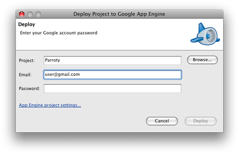

.. Licensed to the Apache Software Foundation (ASF) under one
   or more contributor license agreements.  See the NOTICE file
   distributed with this work for additional information
   regarding copyright ownership.  The ASF licenses this file
   to you under the Apache License, Version 2.0 (the
   "License"); you may not use this file except in compliance
   with the License.  You may obtain a copy of the License at

..   http://www.apache.org/licenses/LICENSE-2.0

.. Unless required by applicable law or agreed to in writing,
   software distributed under the License is distributed on an
   "AS IS" BASIS, WITHOUT WARRANTIES OR CONDITIONS OF ANY
   KIND, either express or implied.  See the License for the
   specific language governing permissions and limitations
   under the License.

Python Tutorial
===============

Robots are applications that interact with a Wave through the Wave robot
protocol. On the public Wave server, we only support robots hosted with Google
App Engine, so this tutorial uses App Engine as the development environment.

In this tutorial, we'll use the Python client library to develop a sample
robot. (The concepts apply here equally well to users of the Java™ client
library, though implementation details will be different.) In this brief
tutorial, you will create a simple robot, upload it to App Engine, and see it
working with Wave.

Before you get started, make sure you have Python 2.5 or higher installed on
your system. You can determine if you have Python installed (and what version
is installed) by executing the following command from the command line:

::

   hostname$ python --version
   Python 2.6.2

You can download Python from the Python downloads page.

The Python Client Library
-------------------------

Development of Google Wave robots requires compiling with a client library.
This tutorial uses the Wave Robot Python Client Library available on Google
Project Hosting. This project contains the source code for the library itself
at the following location:

* The Google Wave Robot Python Client Library

Create a directory to hold your source code for your Python robot and extract
the Python client library into a waveapi directory using the following svn
command:

::

   hostname$ svn checkout http://wave-robot-python-client.googlecode.com/svn/trunk/src/waveapi waveapi

This command will create a waveapi directory within your current source code
directory.

Setting Up App Engine
---------------------

You can develop Wave robots and other web applications for App Engine using
your Python development tools. Before you continue, follow the instructions for
installing the Python SDK in the App Engine Documentation.

Registering Your Application with App Engine
^^^^^^^^^^^^^^^^^^^^^^^^^^^^^^^^^^^^^^^^^^^^

You will also want to register your robot using an Application ID at
https://appengine.google.com.. You are allowed to register up to 10 application
IDs, and application registrations cannot be undone or deleted, nor can an
application ID be changed after it is registered. If you wish to conserve your
allotted application registrations, you may want to choose an application ID
you know you will use for a future project. As well, you may wish to reserve
one ID for testing purposes of your robots.

Go to the App Engine Administrator Console in your web browser. Sign in using
your Google account, creating one if necessary. If you haven't used this
account with App Engine before, you may also be prompted to verify your account
using SMS and a mobile phone.

Under My Applications click the Create an Application button. Choose an
application ID, and follow the prompts to complete the registration. The new
application appears in the list. You can click its name to visit the
Administrator Console for this application.

Configuring Your Python Application
^^^^^^^^^^^^^^^^^^^^^^^^^^^^^^^^^^^

Once you have a valid application ID, create a new app.yaml application
specification within the root of your source directory with the following
content:

::

   application: applicationName
   version: 1
   runtime: python
   api_version: 1

   handlers:
   - url: /_wave/.*
     script: wave.py
   - url: /static
     static_dir: static

For purposes of the tutorial, we have named the Python script "wave.py", but
the name is unimportant. We have also defined a URL handler for a static
folder, to serve assets like images and stylesheets.

For more information on getting started with App Engine, see the App Engine
Getting Started Guide for Python.

Hello, Robot!
-------------

Now it's time to write our Python code. First create a wave.py inside the
project folder. Add the following code:

.. code-block:: python

   import logging

   from waveapi import events
   from waveapi import robot
   from waveapi import appengine_robot_runner

   def OnWaveletSelfAdded(event, wavelet):
     """Invoked when the robot has been added."""
     logging.info("OnWaveletSelfAdded called")
     wavelet.reply("\nHi everybody! I'm a Python robot!")

   def OnWaveletParticipantsChanged(event, wavelet):
     logging.info("OnParticipantsChanged called")
     new_participants = event.participants_added
     for new_participant in new_participants:
       wavelet.reply("\nHi : " + new_participant)

   if __name__ == '__main__':
     samplebot = robot.Robot('Sample Robot',
         image_url='http://sample-bot.appspot.com/static/icon.png',
         profile_url='http://code.google.com/apis/wave/')
     samplebot.register_handler(events.WaveletParticipantsChanged, OnWaveletParticipantsChanged)
     samplebot.register_handler(events.WaveletSelfAdded, OnWaveletSelfAdded)
     appengine_robot_runner.run(samplebot)

We'll explain this code in the next sections.

Importing the Client Libraries
^^^^^^^^^^^^^^^^^^^^^^^^^^^^^^

To make a python application into a robot, we need to include the Python robot
library using the following import statements:

.. code-block:: python

   import logging

   from waveapi import events
   from waveapi import robot
   from waveapi import appengine_robot_runner

We also import the logging module, which is a good practice to get
informational messages to show up in the AppEngine logs.

Defining your Main Function
^^^^^^^^^^^^^^^^^^^^^^^^^^^

Once you have imported the proper libraries, define your main function. Note
that we do this at the bottom of the file, so that we can refer to defined
functions above the __main__ declaration.

.. code-block:: python

   if __name__ == '__main__':
     samplebot = robot.Robot('Sample Robot',
         image_url='http://sample-bot.appspot.com/static/icon.png',
         profile_url='http://code.google.com/apis/wave/')
     samplebot.register_handler(events.WaveletParticipantsChanged, OnWaveletParticipantsChanged)
     samplebot.register_handler(events.WaveletSelfAdded, OnWaveletSelfAdded)
     appengine_robot_runner.run(samplebot)

This code simply defines a new robot with the given name, sets some additional
profile information, registers a few event handlers, telling the system we are
interested in the WaveletParticipantsChanged and WaveletSelfAdded events, and
then runs the robot.

.. note::
   that the Robot() constructor implicitly defines the Robot's Profile by
   assigning constructor arguments to profile settings. The Robot's name,
   passed as the first argument, is assigned as the Robot profile's name
   property, for example. An image passed within image_url will be used as the
   Robot's avatar, while profile_url specifies a URL which explains the purpose
   and usage of the robot.

.. note::
   The Google Wave client caches profiles for robot participants on (about) an
   hourly basis, so recent changes to a robot's profile may not be immediately
   reflected in the client.

Accessing Waves
^^^^^^^^^^^^^^^

We want to use the WaveletSelfAdded event to detect when the robot itself is
added to the wave, and write information back into the wave. We'll write an
OnWaveletSelfAdded() function to handle our event first:

.. code-block:: python

   def OnWaveletSelfAdded(event, wavelet):
     """Invoked when the robot has been added."""
     logging.info("OnWaveletSelfAdded called")
     wavelet.reply("\nHi everybody! I'm a Python robot!")

We'll also want to to use the WaveletParticipantsChanged event to detect when
anyone other than a robot is added to the wave. We'll write an
OnWaveletParticipantsChanged() function to handle that event:

.. code-block:: python

   def OnWaveletParticipantsChanged(event, wavelet):
     logging.info("OnParticipantsChanged called")
     new_participants = event.participants_added
     for new_participant in new_participants:
       wavelet.reply("\nHi : " + new_participant)

Whenever any participants are added or removed from the wave, it will receive
this event. For each participant that is added, we'll loop through the
participants_added property of the event and add a blip welcomin the user.
(Note that the event system may bundle multiple participants together into one
event.)

Robot Capabilities
^^^^^^^^^^^^^^^^^^
The set of events which the robot handles implicitly define its capabilities.
The Python client library automatically creates a document served at
/_wave/capabilities.xml which indicates what events for which the robot has
implemented event handlers. The following capabilities.xml file is similar to
that which will be created by the above code:

.. code-block:: xml

   <w:robot xmlns:w="http://wave.google.com/extensions/robots/1.0">
     <w:version>ffffde4b96ce40f6</w:version>
     <w:protocolversion>2.0</w:protocolversion>
     <w:capabilities>
       <w:capability name="WAVELET_SELF_ADDED" />
       <w:capability name="WAVELET_PARTICIPANTS_CHANGED" />
     </w:capabilities>
   </w:robot>

This capabilities file indicates that the robot handles Wave events named
WAVELET_SELF_ADDED and WAVELET_PARTICIPANTS_CHANGED. These events are used
internally by the Wave Robot protocol for communication between the Wave server
and the robot. When the robot receives such events, it encapsulates any
associated data (such as the current wavelet) and passes them off to your event
handlers (OnWaveletSelfAdded() and OnWaveletParticipantsChanged() in this case).

Robots within the Wave API are versioned. This versioning allows the Wave
system to detect when robots have changed and/or their capabilities have been
altered. If you modify a robot's capabilities (by adding or removing monitored
events, for example), or modifying the events to pass different data, the Wave
system will check if the robot version is different than what it has cached.
(The robot version is simply a hash string.) If so, Wave will refresh the
capabilities.xml file and alter the system to generate any new events you've
indicated interest in.

Deploying the Robot
-------------------

You can test your new robot by deploying it to App Engine, and then adding it
to a wave.

.. note::
   No mechanism currently exists to test Wave robots on your local machine with
   the App Engine development server.

To deploy the application to App Engine, use whichever App Engine launcher is
applicable for your Operating System. (This tutorial was written using the
Mac OS GoogleAppEngineLauncher.) When deploying, the App Engine launcher will
ask you for the username and password associated with the registered
application, and execute appcfg.py.

The following is sample output from the Mac OS launcher:

::

   *** Running appcfg.py with the following flags:
       --no_cookies --email=username@gmail.com --passin update
   Scanning files on local disk.
   Initiating update.
   Password for username@gmail.com: Cloning 1 application file.
   Deploying new version.
   Checking if new version is ready to serve.
   Closing update: new version is ready to start serving.
   Uploading index definitions.
   If deploy fails you might need to 'rollback' manually.
   The "Make Symlinks..." menu option can help with command-line work.
   *** appcfg.py has finished with exit code 0 ***

You can check that your application is available by loading the Robot's
http://appName.appspot.com/_wave/capabilities.xml file. This XML file is
auto-generated by the Python client library and indicates the events with which
the robot is programmed to respond. A typical file is shown below:

.. image:: capabilities-xml.png

Adding the Robot to the Wave
----------------------------

You add a robot to a wave by adding it as a participant in the wave with which
you want it to interact.

Within Wave, now create a new wave. Add your robot to the wave using its Wave
ID, which is the App Engine application ID followed by @appspot.com (for
example, dummyrobot@appspot.com.) The robot joins the wave, and adds its
greeting.

Congratulations! You've built your first Wave Robot!