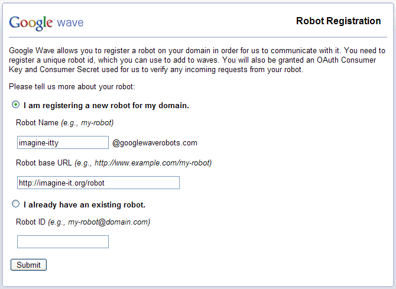
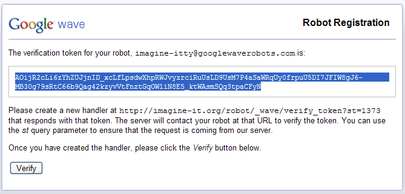
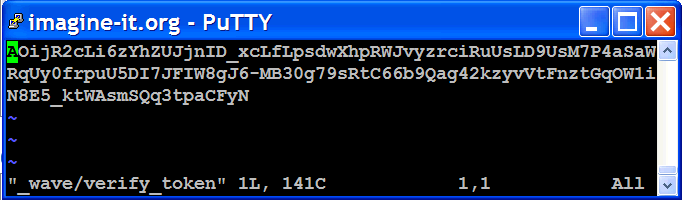
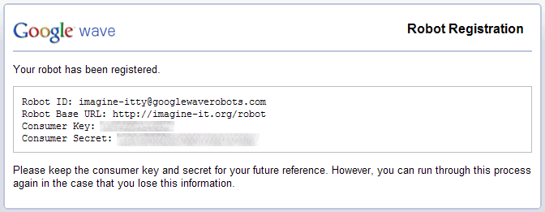

.. Licensed to the Apache Software Foundation (ASF) under one
   or more contributor license agreements.  See the NOTICE file
   distributed with this work for additional information
   regarding copyright ownership.  The ASF licenses this file
   to you under the Apache License, Version 2.0 (the
   "License"); you may not use this file except in compliance
   with the License.  You may obtain a copy of the License at

..   http://www.apache.org/licenses/LICENSE-2.0

.. Unless required by applicable law or agreed to in writing,
   software distributed under the License is distributed on an
   "AS IS" BASIS, WITHOUT WARRANTIES OR CONDITIONS OF ANY
   KIND, either express or implied.  See the License for the
   specific language governing permissions and limitations
   under the License.

Registration
============

Google Wave now supports robots that run on non-App Engine domains. To use a
robot on your own domain, you must register it to obtain a consumer key and
secret that you can specify in your code. At this time, non-App Engine robots
can only run on WaveSandbox.com. In the future, they will be enabled on Wave
Preview.

The 3-step registration process is shown below:

1. To get started, visit the registration page for WaveSandbox.com.

   * Select the first option.
   * Specify a name for your robot. This name must not overlap with any
     existing robot app IDs or GMail addresses, even if the name corresponds
     to an app ID that you own.
   * Specify the base path for your robot. The wave server will append
     "_wave/robot/jsonrpc" to this path when communicating with your robot.

2. Create a static file or servlet at the given URL that contains the
   verification token.

3. Store the consumer key and secret in a credentials file, and use them to
   setup Oauth for your robot before sending operations.

