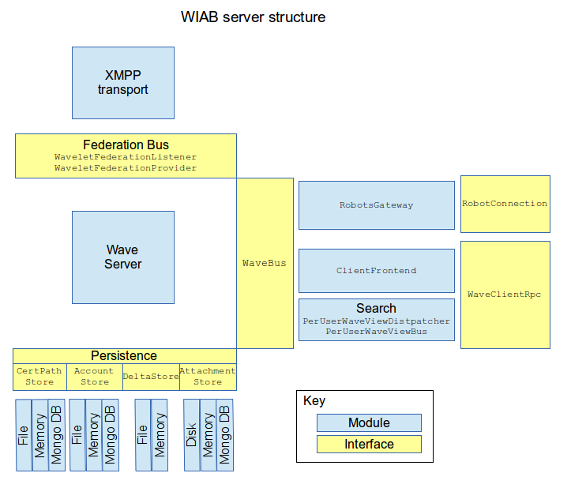
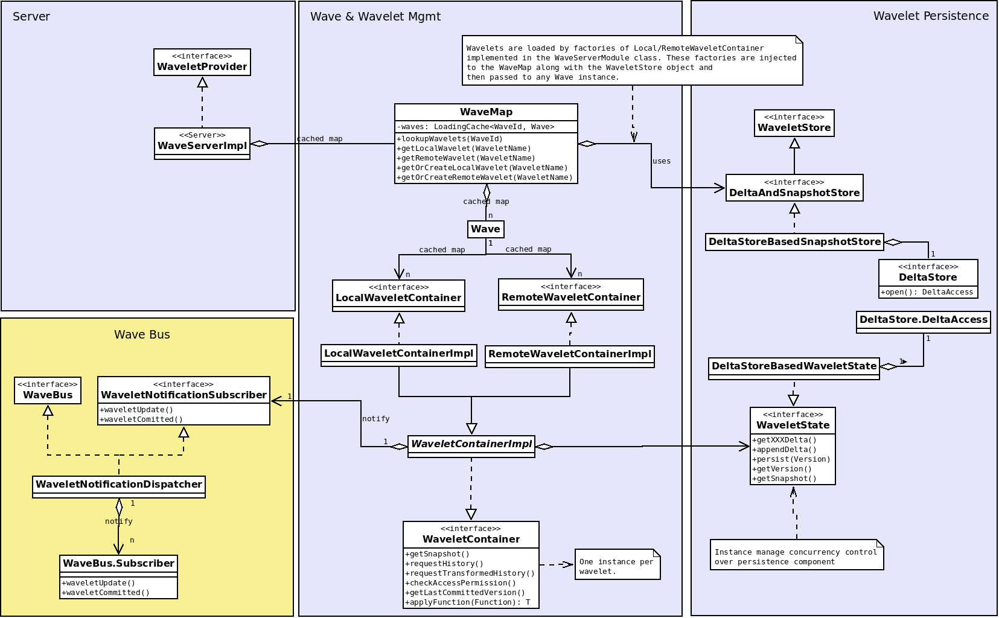
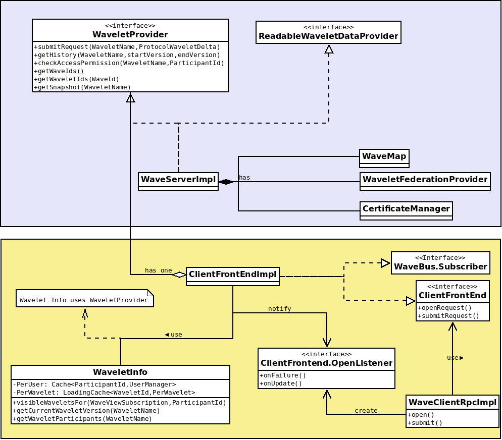

.. Licensed to the Apache Software Foundation (ASF) under one
   or more contributor license agreements.  See the NOTICE file
   distributed with this work for additional information
   regarding copyright ownership.  The ASF licenses this file
   to you under the Apache License, Version 2.0 (the
   "License"); you may not use this file except in compliance
   with the License.  You may obtain a copy of the License at

..   http://www.apache.org/licenses/LICENSE-2.0

.. Unless required by applicable law or agreed to in writing,
   software distributed under the License is distributed on an
   "AS IS" BASIS, WITHOUT WARRANTIES OR CONDITIONS OF ANY
   KIND, either express or implied.  See the License for the
   specific language governing permissions and limitations
   under the License.

OverView of Design Structure
============================

.. toctree::
   :maxdepth: 1

   sourceCode
   clientDesign
   repositoryStructure

This is an overview of WiaB's server structure, provided by Dave in the mailing list, and which may not be 100% accurate:

Wave Server
-----------

This is a high level view of some classes which make up the Wave Server component of WIAB. It isn't a fully detailed diagram.

Classes are grouped in funtional areas:

* Server:  classes orchestrating wavelets operations.
* Wave and Wavelet management: classes representing wave and wavelet entities and also the entry point for wave/wavelet storage, the WaveMap class.
* Wavelet persistence: classes providing persistence for wavelets.
* Wave Bus: the gateway to WIAB clients.

WaveMap
-------

It's the component which provides access to wave/wavelet entities, renote and local ones. Its only client is the WaveServerImpl component. There is only one instance and it has a reference to a WaveletStore implementation in order to use the wavelet persistence.

In general, the WIAB server works at wavelet level, almost all interfaces use wavelet as basic abstraction for parameters and return values. E.g. WaveMap allows to retrieve wavelets by name, but not the whole Wave, which is just an internal entity of the Wave class.

Wavelet cache and factories
---------------------------
At WaveMap creation, references to all wavelets are got from persistence and then put in a caché (see WaveMap.waves:LoadingCache<WaveId,Wave>). So, when a Wave is requested from the waves map, the underlying Wave object is created and then remote and local wavelets are cached.

A wave object has again cache maps for both remote and local wavelets. These cache's rely on factories implemented and injected from the WaveServerModule class to load the right wavelets.

Wave Bus
--------

The Wave Bus is the componet which dispatchs wavelet change notifications to its subscribers or clients. The WaveBus interface it's implemented by the WaveletNotificationDispatcher.
Wavelet's notifications are fired from the wavelet containers (WaveletContainerImpl) via the WaveletNotificationSubscriber interface which is also implemented by the realization WaveBus class WaveletNotificationDispatcher. Clients are those implementing the WaveBus.Subscriber interface:

* ClientFrontendImpl
* PerUserWaveViewDispatcher
* RobotsGateway

Wave Bus Subscribers
--------------------

:strong:`Client Frontend`

The *ClientFrontendImpl* uses the server injected as a *WaveletProvider* for:

* submit deltas to a wavelet
* get wavelet's history of deltas
* get wavelets Ids from a wave
* get a wavelet snapshot

The ClientFrontend is a proxy between UI clients and the Wave server. UI Clients sent  RPC requests to open a communication channels for each Wave-Partincipant pair. This happens when the WaveClientRpcImpl component calls the method openRequest(). Then, a listener object (of type ClientFronted.OpenListener) is created in order to receive asyncronous updates for that Wave's wavelets.

First call to the channel listener: it's performed by ClientFrontend.openRequest() method and it provides a snapshot of the Wave. This is the only time when a full snapshot of a wave is retrieved from the server.
Second and rest calls to the channel listener:  After channel is opened, listener is called anytime an update for the wave happens. This is performed by the WaveViewSubscription object for that channel. It manages the wave state using WaveletChannelState objects, a caché (or queue) of deltas to be submitted in a specifc wavelet. The WaveViewSubscription will call the channel listener in the method sendUpdate(), where only deltas are sent -no snapshots-.
