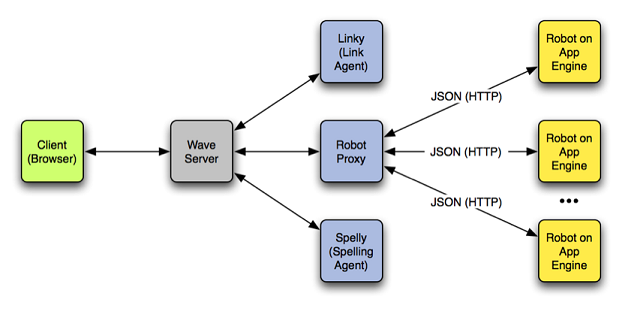

.. Licensed to the Apache Software Foundation (ASF) under one
   or more contributor license agreements.  See the NOTICE file
   distributed with this work for additional information
   regarding copyright ownership.  The ASF licenses this file
   to you under the Apache License, Version 2.0 (the
   "License"); you may not use this file except in compliance
   with the License.  You may obtain a copy of the License at

..   http://www.apache.org/licenses/LICENSE-2.0

.. Unless required by applicable law or agreed to in writing,
   software distributed under the License is distributed on an
   "AS IS" BASIS, WITHOUT WARRANTIES OR CONDITIONS OF ANY
   KIND, either express or implied.  See the License for the
   specific language governing permissions and limitations
   under the License.

FAQ's
=====

.. toctree::

Code
----

Where are the binaries?
^^^^^^^^^^^^^^^^^^^^^^^

The design of the server is moving very quickly with almost daily updates to the source code in the repository so any
binaries would be very quickly out of date. We've worked hard to make the server have as few dependencies as possible,
you should only need to install Ant above and beyond the required Java 6 SDK.

Does it run on App Engine? TODO: is this still true?
^^^^^^^^^^^^^^^^^^^^^^^^^^^^^^^^^^^^^^^^^^^^^^^^^^^^

It's not in our medium-term plan to have Wave in a Box run on App Engine.

Does it support the embed API?
^^^^^^^^^^^^^^^^^^^^^^^^^^^^^^

There is no plan to support embedding in the open source plan, but it should be fairly straightforward for a developer
to modify the code so that there is an output of the client that includes only the wave panel. (The Google Wave embed
API basically did that-- just hid all the other panels).

You can see a basic Embed API JS here: http://wave-api.appspot.com/public/embed.js

How similar will robots be to robots suitable for Google Wave?
^^^^^^^^^^^^^^^^^^^^^^^^^^^^^^^^^^^^^^^^^^^^^^^^^^^^^^^^^^^^^^

We hope to have the protocols be quite similar, and if there are changes, they will be made to improve the protocol for
the better. If you plan on running Wave-in-a-Box when available and want to develop robots in preparation for that,
then we'd recommend developing them according to the current specification.

Does it include the spell-checking or linking agent?
^^^^^^^^^^^^^^^^^^^^^^^^^^^^^^^^^^^^^^^^^^^^^^^^^^^^

The code does not include the spell-checking agent ("Spelly") and will probably not include the linking agent ("Linky").

Protocol & Data Models
----------------------

How do I define ACLs for a Wave?
^^^^^^^^^^^^^^^^^^^^^^^^^^^^^^^^
As of right now the Access Control to a wavelet is simply boolean, that is, you either have full read-write access to a
wavelet, or you have no access to a wavelet. There have been recurring questions about finer grained controls, and while
ACLs are currently under discussion, at this point we don't have anything solid enough to put forward as a proposal.

What is the client-server protocol?
^^^^^^^^^^^^^^^^^^^^^^^^^^^^^^^^^^^
The focus of our open source and protocol work at this point is on the federation protocol, which is critical for
getting inter-operable server implementations, that is, for allowing many other people to build Wave servers and have
them interop with each other and with the Google Wave server. We have definitely heard the requests for defining a
client-server protocol, but at this time the team doesn't have the time to put into such an effort.

If you are interested in working on the client-server protocol we are happy to host that discussion here, and the
client-server protocol as implemented in the open source server would be a fine place to start.

What's the XML schema for waves? Why isn't it HTML5?
^^^^^^^^^^^^^^^^^^^^^^^^^^^^^^^^^^^^^^^^^^^^^^^^^^^^

Wave documents differ from XML in two ways:

* they have a much smaller set of allowed node types, only elements and text
* they include stand-off key/value annotations, which are not part of XML

The primary reason we don't use a highly structured format like HTML is that such a format does not have desirable
properties under operational transformation, when multiple clients edit the same document concurrently. While HTML
attempts to separate semantic content from presentation, waves also need to be concerned with the operational
transformation layer underneath, and HTML makes OT (Operational Transforms) difficult if not impossible. Wave
documents do have schemas, however. These are currently defined in the org.waveprotocol.wave.model.schema package.

What about attachments?
^^^^^^^^^^^^^^^^^^^^^^^
Attachments will eventually be rolled into the federation specification. The current whitepaper describes the design of
existing non-federated attachment system and is a good place to start learning about attachments.

What is the difference between an Agent and a Robot?
^^^^^^^^^^^^^^^^^^^^^^^^^^^^^^^^^^^^^^^^^^^^^^^^^^^^
This diagram shows the relationship between agents and robots:

An agent runs on the server and performs services there. A robot proxy is just an agent that delegates out actions to
robot servers over HTTP and acts on the robot servers behalf. The example code contains a simple agent called Echoey.