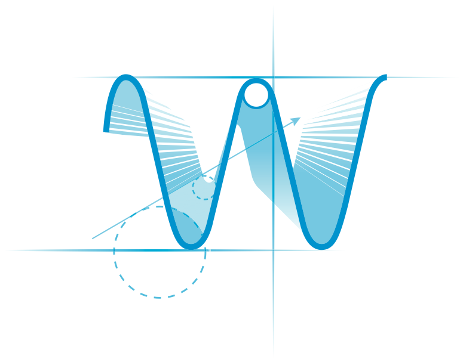

.. Licensed to the Apache Software Foundation (ASF) under one
   or more contributor license agreements.  See the NOTICE file
   distributed with this work for additional information
   regarding copyright ownership.  The ASF licenses this file
   to you under the Apache License, Version 2.0 (the
   "License"); you may not use this file except in compliance
   with the License.  You may obtain a copy of the License at

..   http://www.apache.org/licenses/LICENSE-2.0

.. Unless required by applicable law or agreed to in writing,
   software distributed under the License is distributed on an
   "AS IS" BASIS, WITHOUT WARRANTIES OR CONDITIONS OF ANY
   KIND, either express or implied.  See the License for the
   specific language governing permissions and limitations
   under the License.

Wave Logo Usage
===============

The following Wave Logo can be used, reproduced, and modified freely in accordance with the
Creative Commons Attribution (CC-BY) license. When using the Wave Logo or any modification of it, proper attribution
is required under the terms of the Creative Commons Attribution license.

.. _Vector Wave Logo: https://cwiki.apache.org/confluence/download/attachments/31823332/OpenWaveLogo.eps?version=1&modificationDate=1369894230000&api=v2