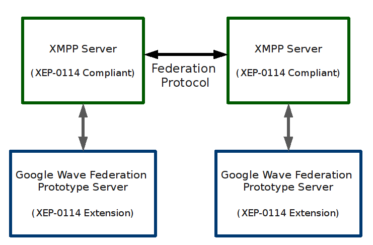
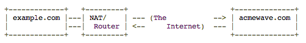

.. Licensed to the Apache Software Foundation (ASF) under one
   or more contributor license agreements.  See the NOTICE file
   distributed with this work for additional information
   regarding copyright ownership.  The ASF licenses this file
   to you under the Apache License, Version 2.0 (the
   "License"); you may not use this file except in compliance
   with the License.  You may obtain a copy of the License at

..   http://www.apache.org/licenses/LICENSE-2.0

.. Unless required by applicable law or agreed to in writing,
   software distributed under the License is distributed on an
   "AS IS" BASIS, WITHOUT WARRANTIES OR CONDITIONS OF ANY
   KIND, either express or implied.  See the License for the
   specific language governing permissions and limitations
   under the License.

Federation
==========

.. toctree::
   :hidden:

   federation/certificates
   federation/openfire
   federation/prosody

.. todo:: Move links over to Apache infra. Explain server.federation.config.

Introduction
------------
Okay, so now you have WIAB up and running on your laptop. You can successfully login and talk to yourself. Now you're
getting the urge to talk to other people on other Wave servers. In order to do this you need to Federate.

In order to federate your server you are going to need the following:

1. A domain name
2. An ssl certificate from a trusted source (in this case, we use StartSSL) (Recommended, but not necessary whilst you
   test federation)
3. An XMPP server

Most of the instructions for setting up these things are found in the following child pages:

* :ref:`Certificates`
* :ref:`Openfire-Installation`
* :ref:`Prosody-Installation`

This document will walk you through setting up federation. With the exception of the configuration script, the
instructions will be OS agnostic.

The utility of waves is greatly enhanced if they can be federated in the sense that they are shared between users from
different organisations, hosted by different service providers across the Internet. This is accomplished by the Apache
Wave federation protocol, a server-to-server network protocol between service providers, supporting low-latency,
concurrent updates to conversations ("live typing") and domain authentication.

:strong:`STOP.`

:strong:`IF YOU ARE JUST TRYING TO SETUP FEDERATION ON YOUR SERVER FOLLOW THE LINKS ABOVE. IF YOU HAVE A 'SPECIAL' SETUP
, OR WANT TO UNDERSTAND HOW IT WORKS, YOU MAY CONTINUE BELOW THIS LINE.`

Here are some resources that explain the protocol and show how to run a federated "Wave in a Box" wave server:

* The federation protocol `white paper <http://wave-protocol.googlecode.com/hg/whitepapers/google-wave-architecture/
  google-wave-architecture.html>`_ that accompanied the launch of Google Wave at Google IO 2009.
* The `secure server authentication design <http://www.waveprotocol.org/whitepapers/wave-protocol-verification>`_.
* The `draft protocol specification <http://wave-protocol.googlecode.com/hg/spec/federation/wavespec.html>`_.
* Wave in a Box `installation instructions <http://www.waveprotocol.org/code/installation>`_.

After you have `installed <http://www.waveprotocol.org/code/installation>`_ your XMPP server and the Federation
extension, you can federate with other Wave servers.

Overview
--------

To get federation working the two servers that are going to talk will need a clear view of each other. That is, each
server in the conversation needs to be able to initiate a connection with the other server doing federation, and
vise-versa. Not only does that mean that your server needs to be found via DNS, it also means that the correct port to
use for federation must be able to be found and used.

A wave server (e.g. the one hosting waves at "initech-corp.com") will attempt to send updates to a remote wave server
(e.g. the one hosting waves at "other.com") whenever a wavelet with a remote participant (e.g. "bob@other.com") is
updated (I.e. any operation is applied, including AddParticipant?("bob@other.com")). The other case where a wave server
will send a message to a remote wave server is to submit a delta on a wave hosted at the remote wave server. The domain
name for the remote wave server is taken directly from the participant's ID (e.g. "other.com").

If no existing XMPP connection exists between the XMPP servers to which the wave servers are connected (via the XMPP
component protocol), a new connection needs to be established. The connection is established using XMPP hostname
resolution (draft-ietf-xmpp-3920bis) and XMPP service discovery (XEP-0030). Where a XMPP server does not offer XMPP
service discovery, or the hostname resolution on the domain name fails, a guess is made about where the wave service is
available; "wave." is prepended to the the remote domain name.

Connection Establishment
------------------------

This describes the algorithm by which two Wave servers establish a connection for the purpose of federation. In this
description the functionality of the XMPP server and the wave server XMPP component are conflated into "XMPP server".
In the description below we trace the possible steps an Initiating Server (IS) takes to connect to some Other Server
(OS). The following steps reference `draft-ietf-xmpp-3920bis <http://tools.ietf.org/html/draft-ietf-
xmpp-3920bis-03#section-4.2>`_ and XMPP service discovery `XEP-0030 <http://xmpp.org/extensions/xep-0030.html>`_.

1. Initiating XMPP server (IS) attempts to look up the SRV record(s) for _xmpp-server._tcp.other.com (OS).
2. If the lookup succeeds, proceed to step 5.
3. If the lookup fails, attempt an A record lookup for other.com
4. If the lookup succeeds, proceed to step 5, otherwise go to step 13.
5. IS connects to the XMPP server OS and initiates XMPP discovery.
6. If OS supports XMPP discovery, IS enumerates services, one item of which is hopefully "category: collaboration, type:
   google-wave". The enumerated item is available on a jid, e.g. "waveservice.other.com".
7. If IS finds the disco record, and the provided jid does not match the hostname of the existing connection, it will
   attempt to resolve the provided jid via the regular XMPP SRV record lookup e.g. _xmpp-server._tcp.waveservice.other
   .com or the A record fallback e.g. waveservice.other.com.
8. If step 7 succeeds, proceed to step 12, otherwise goto step 9.
9. If OS does not support XMPP discovery, or does not return a discovery item for "google-wave", or the lookup on the
   discovery item failed, IS will make a guess at a service jid by adding "wave." to the remote domain name, e.g.
   "wave.other.com".
10. IS will attempt to resolve the guessed "wave" jid via the regular XMPP SRV record lookup e.g.
    _xmpp-server._tcp.wave.other.com or the A record fallback e.g. wave.other.com.
11. If the lookup succeeds, and the IP or port is different to the connection established in 5. above, connect to the
    new IP/port. If the lookup fails, goto step 13.
12. IS and OS are ready to establish TLS. Stop.
13. Failed to establish a connection. Stop.

.. _federation-background:

Background
----------

SRV Settings
^^^^^^^^^^^^

In order to expose a federation server, you require SRV records that describe which servers and ports that the incoming
connection should use.

The SRV record is analogous to the old MX record for mail servers, that is, it 'points' the incoming query to the
correct server, and assigns priorities to different machines. However it contains extra information on top of this basic
data.

A typical SRV record takes the form of:
::

   _Service._Protocol.Name TTL Class SRV Priority Weight Port Target

A typical Wave SRV record could be:
::

   _xmpp-server._tcp.example.com. 86400 IN SRV 10 0 5269 wave.example.com.

A server trying to connect to the Wave server for example.com would retrieve this record, and proceed to attempt to
connect to wave.example.com on port 5269.

Note you could have several SRV records to specify failover/redundancy or whatever:
::

   _xmpp-server._tcp.example.com. 86400 IN SRV 10 50 5269 wave1.example.com.
   _xmpp-server._tcp.example.com. 86400 IN SRV 10 50 5269 wave2.example.com.
   _xmpp-server._tcp.example.com. 86400 IN SRV 20 0 5269 backup-wave.example.com.

A Records
^^^^^^^^^
Every 'Target' of an SRV should have an appropriate A record in DNS, so that the server can resolve the name to an IP
address. In the example above, you would need to assure that wave.example.com had a valid record, and could be resolved
externally.

Ports
^^^^^
An SRV record defines which port the service is available on. For example the following service is accepting connections
via port 31423:
::

   _xmpp-server._tcp.example.com. 86400 IN SRV 10 0 31423 wave.example.com.

You can specify any valid port number for your server. This is especially useful as in the diagram below, where a wave
server is behind a NAT/Firewall.

In this diagram, you would need to configure the incoming port 31423 (as per our example) on your firewall to pass
through to the correct server. The usefulness of this setup is that you would be able to run multiple Wave servers
behind a firewall, even for multiple domains, and simply assign each one a unique port:
::

   _xmpp-server._tcp.example.com. 86400 IN SRV 10 0 5269 wave.example.com.
   _xmpp-server._tcp.anotherexample.com. 86400 IN SRV 10 0 5270 wave.anotherexample.com.
   _xmpp-server._tcp.fickleexample.com. 86400 IN SRV 10 0 5271 wave.fickleexample.com.

Recommended DNS Configuration
-----------------------------
The following DNS records are recommended. If your Wave server provides hosting for the domain <yourdomain> then:

1. Configure a SRV record for _xmpp-server._tcp.<yourdomain> that points to the port and domain name of your XMPP
   server.
2. If your server supports XMPP disco, and the "google-wave" disco item jid is <yourdomain>, you don't need any other
   records.
3. If your server supports XMPP disco, and the "google-wave" disco item jid is <some prefix>.<yourdomain>, you should
   configure an SRV record for _xmpp-server._tcp.<some prefix>.<yourdomain> that points to the port and domain name of
   your XMPP Wave component server.
4. If your server does not support XMPP discovery, you will need to configure a SRV record for
   _xmpp-server._tcp.wave.<yourdomain>.
5. Using SRV records as described above is the preferred resolution mechanism. If for some reason this does not work
   for you, DNS A records can be used in place of the SRV records.

Example
-------
Let's presume the following setup, that you are running your XMPP server and Federation extension behind a NAT and are
trying to federate with acmewave.com:

We will also presume that the wave XMPP service is running at wave.example.com.

First, acmewave.com needs to be able to look up your server via DNS, so you will need to configure A records for
example.com and wave.example.com that point to your server. How you set that up is particular to your ISP and domain
name provider so we can't give detailed instructions on how to set this up, but there is a command line program to use
to determine if you do have it set up correctly: dig. You can run dig and if each of the following return a good IP
address then you are in good shape (substitute in your domain name on the command line).
::

   $ dig +short -t A example.com
   72.148.43.48
   $ dig +short -t A wave.example.com
   72.148.43.48

Note that you need both your domain name, and the wave sub-domain to resolve via DNS.

Ports and SRV
-------------

Now acmewave.com can find your server but it still might not be able to talk to your XMPP server. If you are behind a
NAT, as in this example, you need to open port 5269 on your server, and forward connections to your NAT/Router that come
in on port 5269 to your server. You may also need to open up port 5269 on your firewall if you have one on your server.

We are almost done, now we just need to set up SRV records for our XMPP services. This is done via SRV records. To do
that you will need to set up two sub-domains, one a sub-domain of example.com and another of wave.example.com, and then
attach SRV records to them. The two subdomains are _xmpp-server._tcp.example.com and _xmpp-server._tcp.wave.example.com.
To each of them you need to attach an SRV record that looks like:
::

   10 0 5269 example.com.

This is just the standard algorithm that XMPP uses to find another server, it prepends xmpp-server.tcp to the domain
name and then looks up the SRV record to find out the port and domain name of the server it needs to connect to.
Remember to set up SRV records for both _xmpp-server._tcp.example.com and _xmpp-server._tcp.wave.example.com. Also note
that the trailing "." isn't a typo, you will need that. To test that you have everything setup properly you can again
use dig:
::

   $ dig +short -t SRV _xmpp-server._tcp.example.com
   10 0 5269 example.com.
   $ dig +short -t SRV _xmpp-server._tcp.wave.example.com
   10 0 5269 example.com.

Testing
-------
Once you have that all configured you can now test federation. Edit run-server.sh and set the ping server to
{{acmewave.com}:
::

   ...
   --xmpp_server_ping="acmewave.com" \
   ...

Now when you start up the server you should see your server ping acmewave.com and then acmewave.com should send back a
packet:
::

   $ ./run-server.sh
   .
   .
   .
   Aug 26, 2009 7:02:47 PM org.waveprotocol.wave.examples.fedone.federation.xmpp.WaveXmppComponent processPacket
   INFO: received XMPP packet:
   <message type="normal" id="4191-2" from="wave.acmewave.com" to="wave.example.com">
   <received xmlns="urn:xmpp:receipts"/>
   </message>
   Aug 26, 2009 7:02:47 PM org.waveprotocol.wave.examples.fedone.federation.xmpp.WaveXmppComponent processMessageReceipt
   INFO: got ping response from acmewave.com
   <message type="normal" id="4191-2" from="wave.acmewave.com" to="wave.example.com">
   <received xmlns="urn:xmpp:receipts"/>
   </message>

Chatting
--------
From within the client create a new wave and add a participant from another federated server:

If that user is available they can now chat with you. Server details and times that people are available are posted to
the wave-dev@incubator.apache.org mailing list. Post yours too and help test federation.