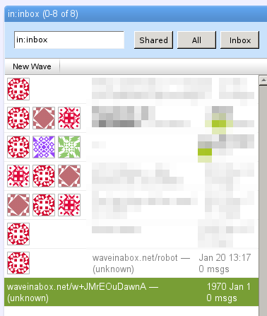

.. Licensed to the Apache Software Foundation (ASF) under one
   or more contributor license agreements.  See the NOTICE file
   distributed with this work for additional information
   regarding copyright ownership.  The ASF licenses this file
   to you under the Apache License, Version 2.0 (the
   "License"); you may not use this file except in compliance
   with the License.  You may obtain a copy of the License at

..   http://www.apache.org/licenses/LICENSE-2.0

.. Unless required by applicable law or agreed to in writing,
   software distributed under the License is distributed on an
   "AS IS" BASIS, WITHOUT WARRANTIES OR CONDITIONS OF ANY
   KIND, either express or implied.  See the License for the
   specific language governing permissions and limitations
   under the License.

FAQ's
=====

.. toctree::

Administration Tips
-------------------

This page contains tips for administrating a Wave in the Box instance, adapted from `bash.vi`_

.. _bash.vi: http://bashvi.tumblr.com/post/41642537267/some-apache-wave-administration-tips

TODO:

* Write instructions for windows as well
* Add pages with instructions for run-export etc

Changing Your Password
^^^^^^^^^^^^^^^^^^^^^^
Changing your password is a simple operation which currently requires the passwd bot.

1. Add the bot "passwd-bot" to a new, private wave
2. Type passwd <current password> <new password> <enter>

To see all the options for the passwd-bot type passwd -help <enter>

.. _Adding-an-Administrator-Account:

Adding an Administrator Account
^^^^^^^^^^^^^^^^^^^^^^^^^^^^^^^

By default, no admin account is set. You can define the admin account by changing the

<property name=”admin_user” value=”@${wave_server_domain}” />

variable in the server-config.xml file and regenerating the config with

ant -f server-config.xml

All you have to do is put the name of the account that should have administrator privileges in front of the @ sign.

Changing Users Passwords
^^^^^^^^^^^^^^^^^^^^^^^^
The admin account can change the password of other users. The process is very similar to changing one’s own password:

1. Log in with your Admin user (see :ref:`Adding-an-Administrator-Account`)
2. Create a new, private wave
3. Add the bot "passwdadmin-bot" to the wave
4. type passwdadmin <username> <new_password> to change a users password

To see the help for the passwdadmin-bot type passwdadmin -help <enter>

Adding a User when registration is disabled
^^^^^^^^^^^^^^^^^^^^^^^^^^^^^^^^^^^^^^^^^^^

The admin account can register new users event when registration is disabled on the server:

1. Log in with your Admin user (see :ref:`Adding-an-Administrator-Account`)
2. Create a new, private wave
3. Add the bot "registration-bot" to the wave
4. type register <username> <password> to create the user with a particular password

To see the help for the registration-bot type register -help <enter>.

Deleting a User
^^^^^^^^^^^^^^^

1. SSH into your Wave Server
2. Stop Wave TODO: How to stop wave server?
3. Change into the Wave installation directory and then /_accounts/
4. Each file in this folder represents a user - labeled <username>@<yourdomain>.account
5. Remove the file corresponding to the correct user (rm does this on linux systems)
6. Start the Wave server again

Deleting Empty Waves
^^^^^^^^^^^^^^^^^^^^
Sometimes weird, empty waves will appears at the bottom of your inbox. The instructions that follow are potentially
unsafe and should only be used if you're sure you know what you are doing.

1. SSH into your wave server
2. Stop Wave
3. Change into the Wave installation directory and then /_deltas
4. ls will show a number of subdirectories with alphanumeric names. Each one of these represents a wave.
5. du -h * will show the size of each of these directories
6. The smallest ones (~20K) are likely to be the empty waves (back them up with tar cfv ../backup.tar <directory1>
   <directory2>)
7. Delete these small directories
8. Start the Wave Server

Log back in and wait for Wave index to be regenerated, if the incorrect waves are deleted restore them from the backups
you created.

Once again, this procedure is potentially unsafe and you should only attempt it if you are confident and have a backup.

Exporting Waves
^^^^^^^^^^^^^^^
Wave comes with means to export all of a users waves and import them into another server or just store them for backup
purposes. This process doesn't have to be performed on the server itself, any user can export their waves allowing them
to make their own personal backups.

1. Download and compile Apache Wave from `source`_
2. In the root directory there is a run-export.sh file, make it executable using chmod +x run-export.sh
3. Run the script by executing `./run-export.sh`_ to see available parameters and access help

For further information on run-export.sh see: run-export.sh

.. _source: http://incubator.apache.org/wave/source-code.html
.. _./run-export.sh: https://cwiki.apache.org/confluence/display/WAVE/run-export.sh

Add your CA to Java
^^^^^^^^^^^^^^^^^^^
Taken and adapted from: `Adding a certificate authority to the Java runtime`_

If your wave server is running with SSL and you signed your ssl certificate with your own CA, you should add that CA to
Java’s trusted list of CAs. Otherwise the internal bots, such as the passwd bot, and scripts, such as the export script,
might not work.

Before you start you will need your CAs public certificate which should be in .pem format.

Type the following command: keytool -import -trustcacerts -file <path to CA key> -alias honet -keystore
$JAVA_HOME/jre/lib/security/cacerts

It will then ask you for a password, the default is: changeit

.. _Adding a certificate authority to the Java runtime:
    http://www.mikepilat.com/blog/2011/05/adding-a-certificate-authority-to-the-java-runtime/

Changing your Avatar
^^^^^^^^^^^^^^^^^^^^
The avatars used in wave are served from `Gravatar`_. This server creates an image based on the hash of an email address
. For Wave the address <username>@<domain> is being hashed and sent to Gravatar for the Avatar creation. You can then
sign up to Gravatar to change the image. This will cause your avatar to instantly change on all sites that use Gravatar.

After the initial creation you are able to add more emails to the Gravator, however Gravatar will send a confirmation
email to each of these addresses with a link to be clicked. This becomes an issue because a wave adress s not an email
address. This can be solved by setting up an Email server temporarily to receive the confirmation links.

On Debian this is as simple as running apt-get install postfix.

During the installation, you’ll be asked for some things. Tell it to run on the internet (and not just locally). It is
very important that you tell it your waves domain name when asked for it. You should have a functioning email server now
running. To make sure it is working we add a unix user with the same name as your wave account: useradd -m -d
/home/<username> -s /bin/bash <username>

Now go to Gravatar, click on “My account” and then “Add an Email Address”. Type in <username>@<wavedomain>. The email
will appear in /var/mail/<username>. Use cat, less or another text editor to view the email.

.. _Gravatar: https://cwiki.apache.org/confluence/display/WAVE/Administration+Tips#
